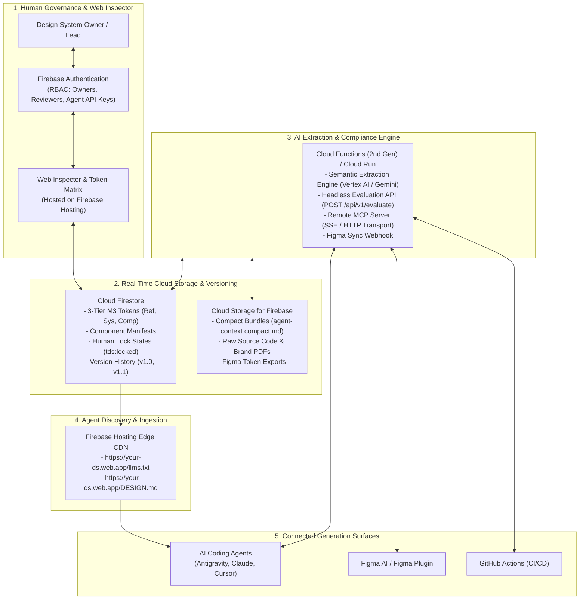
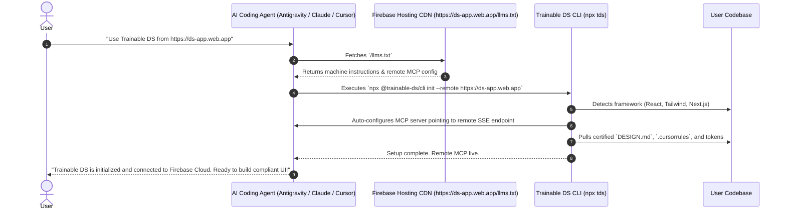
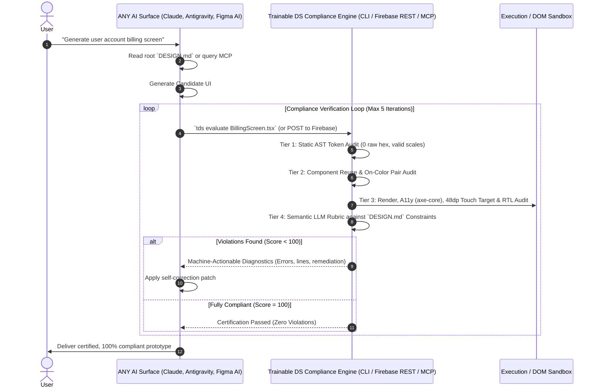
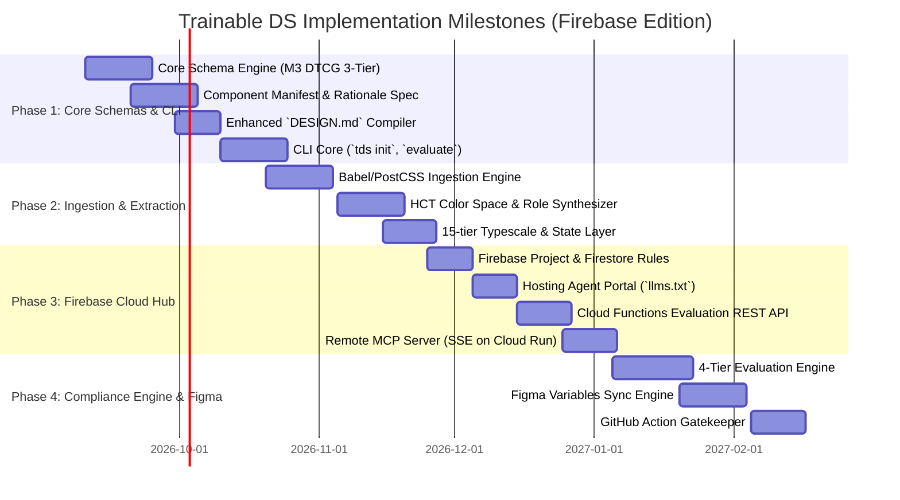

# Product Requirements Document (PRD)
# Project: Trainable DS — Agent-Native Design System Extractor & Compliance Engine

**Status:** Approved Specification  
**Author:** AI Pair Programmer & System Architect  
**Version:** 1.7.0 (Firebase Cloud Architecture Edition: Real-Time Sync, Hosting, Cloud Functions & MCP)  
**Target Date:** Q3-Q4 2026  
**Reference Implementations:** Google Firebase (Firestore, Hosting, Functions, Vertex AI), Google Material Design 3 (`m3.material.io`), Meta Astryx (`astryx.atmeta.com`), Google Stitch `DESIGN.md` (`google-labs-code/design.md`), W3C DTCG, Model Context Protocol (MCP).

---

## 1. Executive Summary & Vision

### 1.1 The Problem
1. **Manual Configuration Hell:** Humans have to look up package names, install multiple CLI tools, edit hidden JSON configuration files (e.g., `claude_desktop_config.json`, `.cursor/mcp.json`, Antigravity settings), and paste thousands of lines of style tokens into prompts.
2. **AI UI Drift:** Without automated context, models (Claude, Antigravity, Cursor) invent ad-hoc hex colors, create non-existent component props, bypass state layers, and fail brand compliance.
3. **The "Too Little Specific" vs. "Bloated JSON" Dilemma:** 
   - Naive text guides like standard Stitch `DESIGN.md` are accessible to LLMs but **too little specific** for enterprise use—lacking 3-tier token hierarchies, component prop interfaces, and verifiable state layers.
   - Conversely, raw DTCG JSON trees or 50,000-line Storybooks overwhelm model context windows, resulting in truncation and hallucinations.
4. **Decentralized Silos:** In multi-developer or enterprise environments, design systems drift across repositories because there is no live cloud backbone to synchronize tokens between code repositories, AI agents, and Figma canvases.

### 1.2 The Solution
**Trainable DS** is an end-to-end platform and cloud toolkit that enables teams to **"train"** (extract and derive) an enterprise-grade design system from heterogeneous inputs (existing web codebases, CSS/Tailwind configs, brand books, and written guidelines) and distribute it globally via **Google Firebase**.

Key Innovations:
1. **Firebase Cloud Backbone:**
   - **Cloud Firestore:** Real-time single source of truth for 3-tier M3 tokens, component manifests, lock states (`tds:locked`), and version history.
   - **Firebase Hosting:** Global edge CDN serving the **Agent Developer Portal (`/llms.txt`)**, root `DESIGN.md`, and the Human Visual Inspector Web UI.
   - **Cloud Functions (2nd Gen) & Cloud Run:** Serverless compute running the **Headless Evaluation API (`POST /api/v1/evaluate`)**, remote **MCP Server** (over SSE/HTTP), and Gemini-powered extraction.
2. **Astryx-Style "Agent-First Developer Portal" Onboarding:**
   A user does not need to read documentation or configure tools. The user simply tells their AI assistant:
   > **"Use Trainable DS in this project"** *(or "Connect this project to our Acme Design System at https://acme-ds.web.app")*
3. **Enhanced `DESIGN.md` Facade (Stitch Paradigm):** Automatically compiles a clean, human-readable, root-level `DESIGN.md` pairing semantic YAML frontmatter with design philosophy ("The Why") and executable constraints.
4. **Material Design 3 (M3) Fidelity:** Inferred systems capture the complete dimensional depth of M3: 3-tier tokens (Reference $\to$ System $\to$ Component), HCT color space tonal palettes (0–100), 36+ semantic color roles, interaction state layers, 15-tier typescales, elevation surface tinting, 6 component functional families, canonical layouts, and RTL bidirectionality.
5. **Universal Closed-Loop Self-Correction:** An AI agent (Antigravity, Claude, Cursor) ingests the artifact, generates a candidate prototype, submits it to the Trainable DS Compliance Engine, receives structured critique/diagnostics, and self-patches the code until it reaches **100% design system compliance**.

---

## 2. Core Tenets & Guiding Principles

1. **Firebase-Powered Real-Time Distribution:** The design system is a live cloud entity. Changes made by design system leads in the web dashboard propagate instantly via Firestore real-time listeners to connected agent IDEs, local CLI daemons, and Figma plugins.
2. **Autonomous Zero-Friction Onboarding (Astryx Parity):** If a user tells their AI *"Use Trainable DS"*, the agent discovers instructions via `https://<app>.web.app/llms.txt`, installs dependencies, auto-configures its own MCP connection, and wires up workspace rules autonomously.
3. **Derive at Full Material Design 3 (M3) Fidelity:** Inferred design systems must capture the complete dimensional depth of M3: 3-tier tokens, HCT tonal palettes, 36+ semantic roles, 5 state layers, 15-tier typescale, elevation surface tinting, 6 component families, 5 window size classes, and $\ge 48\times 48\text{dp}$ touch targets.
4. **The "Enhanced `DESIGN.md`" Facade (Stitch Paradigm):** The system auto-compiles a single, human-readable, root-level `DESIGN.md` file pairing YAML frontmatter tokens with natural language design rationale ("the why").
5. **Omni-Surface AI Interoperability:** Support Agentic IDEs (Antigravity, Claude Code, Cursor), chat web builders (ChatGPT, v0, Lovable), visual design tools (Figma AI), and CI/CD pipelines (GitHub Actions).
6. **Closed-Loop Self-Correction:** Generation is only step one. Multi-tier evaluation (static AST linting, token strictness, accessibility checks, semantic LLM critique, and visual canvas inspection) accessible via CLI, MCP, REST, or Figma plugin.

---

## 3. Firebase Cloud Architecture & System Topology



---

## 4. The 1-Prompt Autonomous Onboarding Workflow



---

## 5. Storage Format & Dual-Layer Artifact Specification

All derived data is structured locally in `.design-system/` and mirrored in Cloud Firestore:

```
.design-system/
├── tds.config.yaml             # Master configuration, framework targets, lock states
├── tokens.json                 # W3C DTCG compliant 3-tier tokens (Reference, System, Component)
├── components.manifest.json    # Machine-readable M3 component anatomy, props, and variant specs
├── rules.md                    # Human-readable & LLM-friendly composition rules & anti-patterns
└── dist/
    ├── agent-context.compact.md  # Token-budgeted context bundle (<6k tokens)
    └── linter-rules.json        # Compiled AST / ESLint rules for static compliance checking
```

### 5.1 Firestore Document Schema
- `design_systems/{dsId}`: Master document with brand metadata and locked status.
- `design_systems/{dsId}/tokens/reference`: HCT tonal palettes (tones 0–100), spatial units, typefaces.
- `design_systems/{dsId}/tokens/system`: 36+ semantic color roles (light/dark), 15-tier typescale, state opacities, elevation tint percentages.
- `design_systems/{dsId}/tokens/component`: Scoped component tokens (e.g. `filled-button`, `card`).
- `design_systems/{dsId}/components/{componentName}`: Anatomical slots, TypeScript props, variant enums, touch target assertions.
- `design_systems/{dsId}/rules/general`: Rationale ("The Why"), sentence-case mandate, executable constraints.

---

## 6. The Enhanced `DESIGN.md` Specification

The auto-compiled root `DESIGN.md` acts as the portable bridge for all file-based AI agents:

```markdown
---
schema: "trainable-ds/v1.7"
name: "Acme Enterprise Design System"
version: "1.7.0"
mode: "dual-scheme"
framework: "react-tailwind"

tokens:
  reference:
    palette:
      primary: { 40: "#00639b", 80: "#97cbff", 90: "#cde5ff" }
      neutral: { 10: "#1a1c1e", 90: "#e2e2e6" }
  system:
    color:
      light:
        primary: "{reference.palette.primary.40}"
        on-primary: "#ffffff"
        primary-container: "{reference.palette.primary.90}"
        on-primary-container: "#001d32"
        surface: "#fdfcff"
        surface-container: "#f0f0f4"
        surface-container-high: "#eaeaf0"
        outline: "#72777f"
      dark:
        primary: "{reference.palette.primary.80}"
        on-primary: "#003353"
        primary-container: "#004a74"
        on-primary-container: "{reference.palette.primary.90}"
        surface: "#1a1c1e"
        surface-container: "#202326"
    typescale:
      headline-medium: { font: "Inter", size: "28px", line: "36px", weight: 600, track: "0px" }
      body-large: { font: "Inter", size: "16px", line: "24px", weight: 400, track: "0.5px" }
      label-large: { font: "Inter", size: "14px", line: "20px", weight: 500, track: "0.1px" }
    state:
      hover: 0.08
      focus: { opacity: 0.10, ring: "3px", offset: "2px" }
      pressed: 0.10
      dragged: 0.16
      disabled: { content: 0.38, container: 0.12 }
    elevation:
      level-0: { shadow: "none", tint: "0%" }
      level-1: { shadow: "0 1px 2px rgba(0,0,0,0.15)", tint: "5%" }
      level-2: { shadow: "0 2px 4px rgba(0,0,0,0.20)", tint: "8%" }
      level-3: { shadow: "0 4px 8px rgba(0,0,0,0.20)", tint: "11%" }
---

# Design System: Acme Design System

## 1. Visual Philosophy & Semantic Intent ("The Why")
> **Design Thesis:** Acme UI embodies **functional clarity and calm density**. Our software powers high-throughput operational analysts.
> - **Visual Calm:** We avoid saturated background fills; surfaces use subtle tonal containers (`surface-container-low` through `high`) to organize information without visual fatigue.
> - **Intentional Color:** Primary action color is reserved strictly for interactive user focus. Never use the primary color for non-interactive decorative elements.
> - **Spatial Discipline:** Strict 8px baseline grid to guarantee visual cadence across complex data tables.

## 2. Foundations Quick-Reference
### Color Roles & Contrast Pairings
- **Primary Action:** `sys.color.primary` paired with `sys.color.on-primary`.
- **Containers:** Use `sys.color.surface-container` for resting cards, `surface-container-high` for elevated dialogs.
- **Fixed Roles:** `primary-fixed` retains luminance across light/dark modes for media and highlight chips.

### Typography Hierarchy (Sentence Case)
- Headers: `headline-medium` (28/36, 600) — Always sentence case.
- Content: `body-large` (16/24, 400) for prose; `body-medium` (14/20, 400) for metadata.
- Interactive Labels: `label-large` (14/20, 500) — Enforce sentence case on all buttons and chips.

### State Layers & Elevation Tinting
- Hover: 8% overlay of `on-*` color.
- Focus: 10% overlay + 3px outline with 2px offset.
- Disabled: 38% opacity on text/icons, 12% on container fills.
- Dark mode elevation relies on primary surface tint overlay (0% to 14%).

## 3. Core Component Library (Contracts & Import Signatures)
*Always import and compose existing primitives. Never build ad-hoc HTML buttons or inputs.*

### Button (`@/components/ui/button`)
- **Import:** `import { Button } from "@/components/ui/button";`
- **Variants:** `filled` (default primary), `elevated`, `tonal`, `outlined`, `text`.
- **Sizes:** `sm`, `md`, `lg` (all guarantee $\ge 48\times 48\text{px}$ touch target on mobile).
- **Example:**
```tsx
<Button variant="filled" size="md" leftIcon={<IconSave />}>
  Save changes
</Button>
```

## 4. Executable Constraints & Anti-Patterns (Evaluated by `tds evaluate`)
1. **NO RAW HEX CODES:** Do not use `#...` or `rgb(...)` in inline styles or Tailwind classes. Map all colors to `sys.color.*`.
2. **NO AD-HOC REINVENTIONS:** Do not write `<button className="...">` or `<input className="...">`. Always import `<Button>` or `<TextField>`.
3. **SENTENCE CASE MANDATE:** Button and menu labels MUST be sentence case (e.g., "Submit application", NOT "Submit Application").
4. **ON-COLOR PAIRING:** Elements with `bg-primary` MUST use text colored with `text-on-primary`.
5. **MINIMUM TOUCH TARGET:** All clickable elements must have an active target of at least 48x48px on compact viewports.
6. **SURFACE CONTAINMENT OVER GHOST OUTLINES:** Never apply arbitrary 1px borders or drop-shadows to cards or content surfaces. Modern flat container architectures establish visual hierarchy strictly through tonal surface contrast (`surface-container-lowest` through `highest`).
7. **SUBPIXEL RENDERING CONTRACT:** Never inject `-webkit-font-smoothing: antialiased;` across stylesheets, as this causes grayscale rasterization and erodes 100–150 weight units from typography on macOS/WebKit. Enforce `-webkit-font-smoothing: auto;`.
8. **ASSET VECTOR SANCTITY:** Always render brand marks and logos as authentic SVG vectors from `icons.json` rather than approximating them with styled HTML text spans.
```

---

## 7. The Autonomous Multi-Tier Compliance Engine



---

## 8. Phased Implementation Roadmap



---

## 9. Success Metrics & KPIs

1. **Autonomous Setup Success Rate:** ≥ 95% of AI agents (Antigravity, Claude, Cursor) successfully self-install dependencies, configure MCP, and wire `DESIGN.md` from the single prompt *"Use Trainable DS"*.
2. **Cloud Synchronization Latency:** Token changes published in Firestore propagate to connected IDEs and Figma in **< 1.5 seconds**.
3. **M3 Taxonomy Coverage:** 100% of inferred systems generate the 3-tier token structure, 36+ semantic color roles, 15 typescale tiers, and 5 state layer definitions.
4. **AI Compliance Improvement:** Rate of ad-hoc hex codes, unmapped spacing, and off-brand font sizes drops to **0%** after running through the Trainable DS evaluation loop.
5. **Touch Target Adherence:** 100% of interactive elements meet the M3 $\ge 48\times 48\text{px}$ touch target mandate.
6. **Sentence-Case Enforcement:** 100% compliance with sentence-case typography on button labels, chip texts, and headers.
7. **Time-to-Certified-Prototype:** Under 90 seconds from initial user prompt to certified, 100% compliant multi-component screen.
