# The Universal Design System Blueprint for AI Coding Agents

> **Protocol:** Trainable AI Design System (v2.0)  
> **Target Audience:** Autonomous AI Coding Agents, Harvesters, and System Architects  
> **Scope:** Universal Design System Extraction, High-Resolution Encoding, and Machine Verification

---

## 1. Executive Directive

When an autonomous AI agent is tasked with **extracting a design system** from an arbitrary target (e.g., Porsche, Google News, GitHub, Stripe, Linear, Apple), the agent must not merely dump raw CSS variables. The agent must apply the **Universal Completeness Blueprint** to uncover, cluster, and encode the design system at the **highest possible resolution** into machine-enforceable contracts:

1. **Tokens Specification (`tokens.json`):** W3C DTCG-compliant semantic tokens with locked contracts and type definitions.
2. **Component Blueprint (`components.json`):** Standard slot taxonomy, variant matrices, and lifecycle state machines.
3. **Agent Directives (`AGENTS.md` & `DESIGN.md`):** Strict persona guidelines, invariant constraints, and reference blueprints.
4. **Machine Evaluator (`@trainable-ds/evaluator`):** Automated AST/DOM linter rules (`TDS-*`) that certify code generation.

---

## 2. The 6-Subsystem Completeness Meta-Schema

A design system is deemed **complete** if and only if all six core subsystems are identified and formalized:

```mermaid
graph TD
    DS["Complete Design System"]
    DS --> S1["1. Typography Subsystem"]
    DS --> S2["2. Color & Theming Subsystem"]
    DS --> S3["3. Spacing & Spatial Subsystem"]
    DS --> S4["4. Shape & Elevation Subsystem"]
    DS --> S5["5. Component Slots & States"]
    DS --> S6["6. Machine Invariant Rules"]

    S1 --> S1_1["Typeface & Fallback Stacks"]
    S1 --> S1_2["Fluid Clamp vs Modular Scales"]
    S1 --> S1_3["Proportional Leading (ex / ratios)"]
    S1 --> S1_4["Multi-Script & CJK Strategies"]
    S1 --> S1_5["Subpixel Font Smoothing"]

    S2 --> S2_1["Canvas vs Surface Tiers"]
    S2 --> S2_2["Accessible Contrast Ramps"]
    S2 --> S2_3["light-dark() & Theming Modes"]
    S2 --> S2_4["Frosted Glass Materials"]

    S3 --> S3_1["Quantum Grid (4px/8px)"]
    S3 --> S3_2["Static & Fluid Spacing Clamps"]
    S3 --> S3_3["12-Column Responsive Grid"]

    S4 --> S4_1["Corner Radius Tier Hierarchy"]
    S4 --> S4_2["Flat Surface vs Outlined vs Shadows"]
    S4 --> S4_3["Multi-Stage Blur Masks"]

    S5 --> S5_1["Standard Slot Taxonomy (#header, #media, etc.)"]
    S5 --> S5_2["Lifecycle States (hover, focus, active)"]
    S5 --> S5_3["Touch Target Invariants (>= 48px)"]

    S6 --> S6_1["TDS-* AST & DOM Linter Invariants"]
    S6 --> S6_2["Automated Evaluation Engine"]
```



---

## 3. Deep Pattern Architecture: Typography

Typography is the foundational voice of any design system. An AI agent extracting typography must look for and encode the following specialized patterns:

### 3.1 Typeface & Script Fallback Architecture
- **Brand Typeface:** Custom webfonts (e.g. `Porsche Next`, `Google Sans`) loaded in lightweight WOFF2 format.
- **The CJK Performance Invariant:** Complete Chinese/Japanese/Korean webfonts weigh 15–30 MB per family. Modern global systems (e.g. Porsche) avoid bundling CJK webfonts to preserve Core Web Vitals (LCP/FCP). Instead, they employ **script-aware system fallbacks** triggered via `:lang()` selectors:
  ```css
  :lang(zh-Hans) {
    --p-font-porsche-next: 'Porsche Next', 'PingFang SC', 'Microsoft YaHei', sans-serif;
  }
  ```
- **Font Smoothing Mandate:** On macOS and WebKit, applying `-webkit-font-smoothing: antialiased` strips subpixel rendering and thins the letterforms artificially. High-fidelity design systems mandate `-webkit-font-smoothing: auto;` to preserve authentic optical stroke weights.

### 3.2 Typescale Models
Modern design systems use one of three typescale models:
1. **Modular Fixed Scale:** Sizes multiply by a constant ratio (e.g. Major Third $1.250$, Perfect Fourth $1.333$). Typical in desktop-first or discrete breakpoint systems.
2. **Fluid Clamp Scale:** Sizes scale continuously across viewport widths using CSS `clamp(min, preferred_vw, max)`.
3. **Hybrid Model (e.g. Porsche Design System):**
   - **Micro-sizes (2xs, xs, sm):** Fixed rem values (`.75rem`, `.875rem`, `1rem`) for reading clarity on mobile.
   - **Macro-sizes (md, lg, xl, 2xl–5xl):** Fluid clamp expressions (e.g. `clamp(1.13rem, 0.21vw + 1.08rem, 1.33rem)`).

### 3.3 Leading / Line-Height Proportionality
- **The Inverse Relationship:** As font size increases, relative line-height must decrease (e.g. body copy $\sim 1.5 - 1.6$, display titles $\sim 1.1 - 1.2$).
- **Font-Relative Geometry (`ex` unit):** Advanced systems calculate line-height dynamically based on font x-height:
  ```css
  --leading-normal: calc(6px + 2.125ex);
  ```

---

## 4. Subsystems 2 to 5: Structural Patterns

### 4.1 Color & Theming
- **Surface Hierarchy:** Base canvas (`--canvas`) $\rightarrow$ Surface container (`--surface`) $\rightarrow$ Frosted layer (`--frosted`) $\rightarrow$ Modal backdrop (`--backdrop`).
- **Contrast Ramps:** Primary text (100% accessible contrast) down through `contrastHigh` (70%), `contrastMedium` (55%), to `contrastLower` (30% for 1px hairline dividers).
- **CSS Native `light-dark()`:** Modern systems encapsulate light and dark values directly in CSS custom properties:
  ```css
  --p-color-canvas: light-dark(#ffffff, hsl(225 66.7% 1.2%));
  ```

### 4.2 Spacing & Layout
- **Quantum Base:** Multiples of 4px or 8px (`4px`, `8px`, `12px`, `16px`, `24px`, `32px`, `48px`, `80px`).
- **Fluid Padding:** Clamped spacing for component internal gutters:
  ```css
  --spacing-fluid-sm: clamp(8px, 0.5vw + 6px, 16px);
  ```

### 4.3 Shape & Surface Elevation
- **Corner Radius Hierarchy:**
  - Micro (`2px - 4px`): Menus, popovers, tooltips.
  - Small (`6px - 10px`): Chips, inputs, sub-cards.
  - Medium (`12px - 18px`): Feed cards, continuous sections, weather cards.
  - Large (`24px - 32px`): Dialogs, modals, bottom sheets.
  - Pill (`9999px`): Action buttons, search bars, coverage pills.
- **Elevation Strategy:**
  - **Flat Surface:** 0 border, 0 shadow (Google News feed cards).
  - **Flat Outlined:** 1px border, 0 shadow (Showcase cards).
  - **Shadow Matrix:** Multi-level ambient/directional shadows.
  - **Frosted Glass:** Progressive multi-stage blur masks with backdrop filters.

### 4.4 Component Slot Taxonomy
All complex containment components must implement the standardized slot contract:
- `#header` / `#eyebrow`: Top category, publisher icon, timestamp.
- `#media`: Image thumbnail, video player, illustration.
- `#title`: Headline or primary title.
- `#content`: Main body copy or AI summary bullet list.
- `#footer` / `#actions`: Action buttons, overflow menu, coverage pill.
- `#secondary`: Sub-stories or nested child cards.
- `#emptyState`: Fallback illustration and guidance.

---

## 5. Machine Invariant Rules (`TDS-*`)

Every extracted design system maps its contracts directly into automated linter checks:

| Rule ID | Severity | Invariant Constraint |
| :--- | :--- | :--- |
| `TDS-GHOST-BORDER-HALLUCINATION` | **CRITICAL** | Flat surface containers must NEVER have borders or box-shadows. |
| `TDS-DIALOG-SURFACE-SPECS` | **CRITICAL** | Dialogs and Modals MUST use large corner radius (28px) and appropriate elevation. |
| `TDS-FLOATING-MENU-SPECS` | **HIGH** | Popovers and Menus MUST use micro corner radius (4px) with popover shadow. |
| `TDS-TOUCH-TARGET-TOO-SMALL` | **HIGH** | Interactive elements MUST provide at least 48x48px touch bounding box. |
| `TDS-RAW-COLOR` | **CRITICAL** | NO raw hex values in component styling; strictly mandate semantic tokens. |
| `TDS-NON-QUANTUM-SPACING` | **HIGH** | Layout spacing MUST adhere to 4px/8px quantum or fluid clamp tokens. |
| `TDS-FONT-SMOOTHING-DEGRADATION` | **HIGH** | NEVER apply `-webkit-font-smoothing: antialiased`; enforce `auto`. |
| `TDS-TYPOGRAPHIC-LOGO-APPROXIMATION` | **CRITICAL** | Brand wordmarks must use authentic SVG vectors, NEVER styled text spans. |
| `TDS-M3-ON-COLOR-MISMATCH` | **CRITICAL** | Elements with `bg-primary` MUST use `text-on-primary` for accessible contrast. |

---

## 6. Agent Harvester Protocol

When directed to extract a design system:
1. **Step 1: Asset & Font Sniffing**
   - Identify preloaded WOFF2 fonts and `@font-face` definitions.
   - Check `:lang()` rules to extract script fallback strategies (e.g. CJK system fonts).
2. **Step 2: Computed Style Sampling**
   - Cluster font sizes across `h1-h6`, `p`, and `span`.
   - Detect `clamp()` expressions vs. modular scale multipliers.
   - Calculate line-height to font-size ratios to identify proportional formulas (`ex` units).
3. **Step 3: Surface & Radius Extraction**
   - Extract canvas, surface, frosted, and contrast ramps.
   - Classify all border-radii into the 5-tier functional hierarchy.
4. **Step 4: Slot Anatomy Mapping**
   - Map component DOM elements into the standard 7-slot taxonomy.
   - Verify interactive element bounding boxes satisfy $\ge 48\times 48\text{px}$.
5. **Step 5: Synthesize Contracts**
   - Emit `tokens.json` (DTCG), `components.json`, `DESIGN.md`, `AGENTS.md`, and dynamic evaluator rules.
