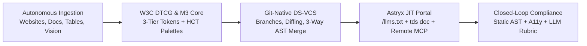
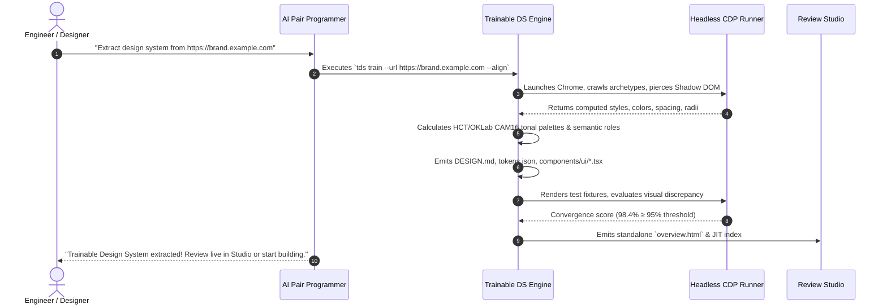
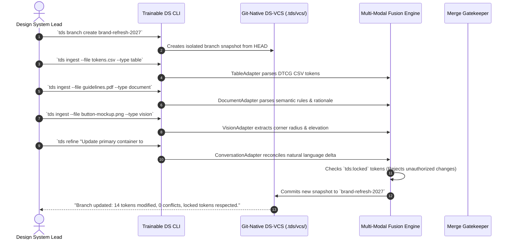
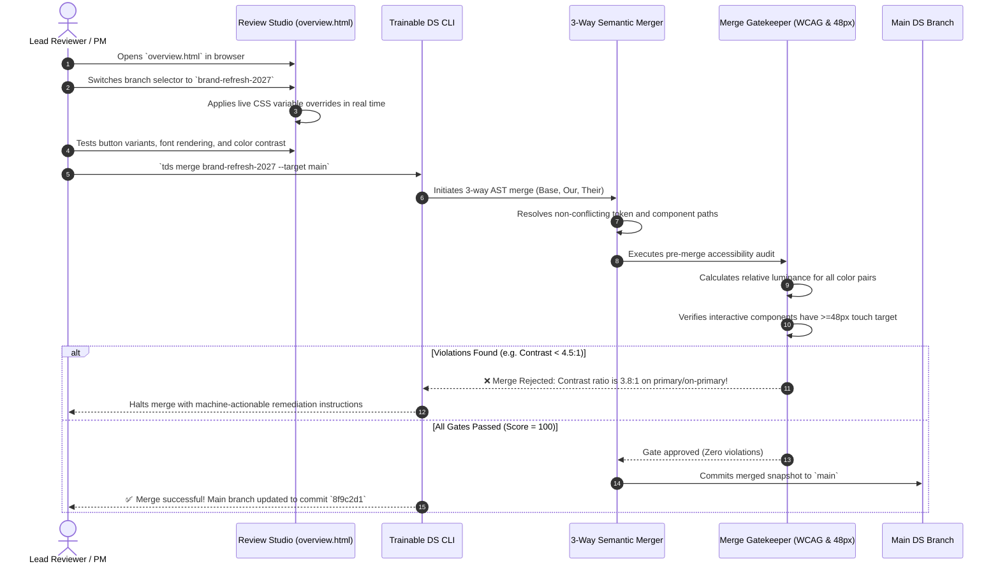
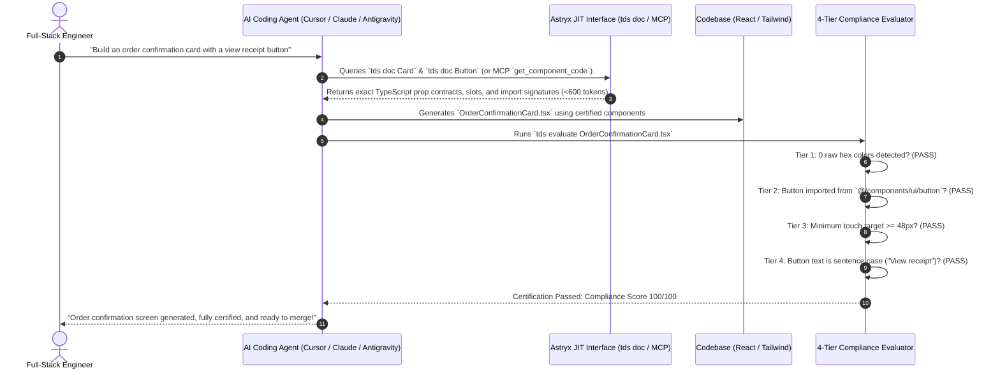
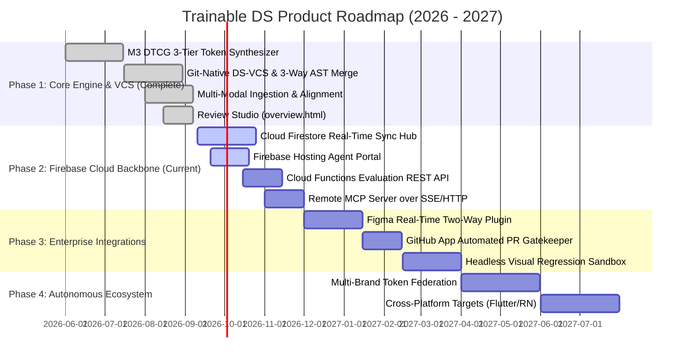

# Product Requirements Document (PRD) & JTBD Strategic Specification
# Project: Trainable DS — Agent-Native Design System Engine & Version-Controlled Compliance Platform

**Document Version:** 2.0.0 (Executive & Technical Strategy Edition)  
**Status:** Approved Specification & Production Blueprint  
**Author:** Principal Product Manager & JTBD Strategist  
**Target Stakeholders:** Executive Leadership (CPO, CTO, VP Engineering), Staff Design Technologists, Lead AI Architects, Design System Operations (DesignOps)  
**Reference Standards:** Material Design 3 (M3 / Google), W3C Design Tokens Community Group (DTCG), Meta Astryx (`astryx.atmeta.com`), Model Context Protocol (MCP), WCAG 2.1 AA/AAA, Google Stitch `DESIGN.md`

---

## 1. Executive Summary & Market Problem

### 1.1 The Macro Trend: The $100B AI UI Generation Shift
Software engineering is undergoing the most rapid paradigm shift in modern computing history. With the explosive enterprise adoption of agentic coding assistants—including **Cursor, Claude Code, GitHub Copilot Workspace, and Google Antigravity**—over 70% of new front-end interfaces across leading tech companies are now scaffolded, generated, or refactored by Large Language Models (LLMs). Goldman Sachs and Gartner estimate that generative AI interfaces and automated developer toolchains represent a **$100B+ market shift** over the next five years.

However, as front-end generation speeds accelerate by 10x to 50x, enterprise engineering organizations have slammed into an existential bottleneck: **The Design-Code Drift Crisis**.

```
+---------------------------------------------------------------------------------------------------+
|                                  THE DESIGN-CODE DRIFT CRISIS                                     |
|                                                                                                   |
|  [ Designers in Figma ] ----(Manual Tokens / PDFs)----> [ Design Silo ]                          |
|                                                                | (Unsynchronized Drift)           |
|                                                                v                                  |
|  [ AI Agents in IDEs ]  ----(Hallucinated Hex & Props)--> [ Rogue UI ] ---> [ Production Outage ] |
|     Cursor / Claude / Copilot                                            - WCAG AA Violations     |
|                                                                          - Inconsistent Padding   |
|                                                                          - Disjointed UX          |
+---------------------------------------------------------------------------------------------------+
```

### 1.2 The Root Cause: Why Traditional Design Systems Fail AI Agents
For the past decade, the design system industry was constructed around human cognitive limitations: centralized Figma component libraries, 50,000-line Storybook instances, Zeroheight documentation sites, and extensive design guideline PDFs. 

When applied to autonomous AI coding agents, these systems fail completely across five fundamental dimensions:

1. **Context Window Exhaustion & Bloat:**
   A standard enterprise Storybook documentation package exceeds **50,000 to 120,000 lines of JSON/MDX**. Dumping full component documentations into an LLM context window consumes tens of thousands of tokens per prompt, triggers context truncation, inflates inference latency by 300%, and costs organizations thousands of dollars in wasted API tokens while causing models to "forget" core system constraints.
2. **Hallucinated Ad-Hoc Styling (The "Raw Hex Disease"):**
   Without constrained machine-readable guardrails, LLMs default to statistical frequency guessing. When asked for a blue button, an agent will arbitrarily output `bg-[#2563eb]`, `p-[13px]`, `rounded-[7px]`, and `font-bold`—ignoring the brand's semantic token taxonomy (`sys.color.primary`, `sys.shape.corner.sm`, `sys.typescale.label.large`). This creates an untamable sea of CSS debt.
3. **Missing State Layers & Elevation Models:**
   Traditional systems document interaction states (hover, focused, pressed, dragged, disabled) in prose or CSS pseudo-selectors. Autonomous AI models consistently emit flat, non-interactive elements that lack accessible focus rings (e.g., 3px outline with 2px offset) or correct state layer opacity overlays (e.g., 8% on-surface hover, 12% disabled container fill).
4. **The "Too Little Specific" vs. "Bloated JSON" Dilemma:**
   - *Too Little Specific:* High-level markdown files (e.g., raw Google Stitch `DESIGN.md`) give agents broad design philosophies ("Use clean typography") but lack exact TypeScript prop signatures, anatomical slot layouts, and strict token mappings.
   - *Bloated JSON:* Unprocessed W3C DTCG token trees (5MB deep JSON) overwhelm the agent's attention mechanism with hundreds of raw color swatches instead of semantic roles.
5. **Zero Version Control for Design Tokens (DS-VCS Void):**
   While codebases have Git, design tokens in most enterprises remain unversioned artifacts scattered across Figma Variable collections, package releases, and CSS files. When a designer modifies a primary brand hue, there is no branch-isolated sandbox to validate downstream breaking changes, no 3-way AST merge engine, and no CI gatekeeper blocking merges that violate WCAG contrast ratios.

---

### 1.3 The Trainable DS Breakthrough
**Trainable DS** is an agent-native, version-controlled design system engine and compliance platform designed from first principles for the generative AI era. It bridges human design intent, mathematical token rigor, and autonomous agent pairs through five foundational pillars:



1. **Autonomous Training & Live Web Harvesting (`tds train --url ...`):**
   Trainable DS can crawl any live enterprise web application or marketing portal, penetrate Shadow DOM boundaries, extract computed CSS styles, harvest `@font-face` WOFF2 definitions, extract raw SVG icons, and mathematically synthesize a full Material Design 3 (M3) token hierarchy in seconds.
2. **Multi-Modal Ingestion Engine:**
   Ingest design truths from any artifact: tabular CSV/JSON token sheets, markdown brand books, visual Figma screenshots/SVGs, or interactive natural language prompts (`tds refine`). The engine fuses disparate inputs into a single authoritative schema while honoring human-locked tokens (`tds:locked`).
3. **Git-Native Design System Version Control (DS-VCS):**
   Full versioning parity with Git located in `.tds/vcs/`: isolated branch creation (`tds branch create <name>`), atomic snapshot commits, visual token and component diffing (`tds branch diff`), and a **3-way AST semantic merge engine** guarded by automated accessibility gates.
4. **Astryx-Parity Just-In-Time (JIT) Agent Experience:**
   Modeled after Meta's cutting-edge Astryx architecture, agents discover the entire system from a single edge-hosted endpoint (`/llms.txt`). Agents never parse 50,000 lines of documentation; instead, they query the exact component contract they need on demand (`tds doc <Component>` or MCP `get_component_code`), consuming less than **500 tokens of context per component**.
5. **Universal Closed-Loop Compliance & Verification:**
   A 5-tier evaluation engine (`tds evaluate`) that audits code before it enters a PR:
   - *Tier 1:* Static AST Token Audit (0 raw hex colors, strict spacing scale enforcement).
   - *Tier 2:* Component Reuse & On-Color Pair Audit (enforcing `sys.color.on-primary` pairing).
   - *Tier 3:* DOM Sandbox & A11y Audit (axe-core integration, mobile $\ge 48\times 48\text{px}$ touch target enforcement, RTL bidirectionality).
   - *Tier 4:* Semantic Content Audit (M3 sentence-case mandates on buttons and headings).
   - *Tier 5:* Visual Fidelity & Anti-Drift Guardrails (zero ghost outlines on flat surface containers, subpixel text rendering enforcement with `-webkit-font-smoothing: auto`, and asset vector sanctity for brand marks).

---

## 2. The Jobs to Be Done (JTBD) Strategic Framework

To build a product that transcends tactical utility and creates deep organizational lock-in, Trainable DS is architected using Clayton Christensen's and Anthony Ulwick's **Jobs to be Done (JTBD) Outcome-Driven Framework**.

```
+----------------------------------------------------------------------------------------------------+
|                                    JTBD STRATEGIC ARCHITECTURE                                     |
|                                                                                                    |
|    +--------------------------+    +--------------------------+    +--------------------------+    |
|    |        PERSONA A         |    |        PERSONA B         |    |        PERSONA C         |    |
|    |   Design System Lead     |    |   Full-Stack Engineer    |    |     Head of Product      |    |
|    |   "Token Sovereign"      |    |   "Velocity Builder"     |    |   "Governance Arbiter"   |    |
|    +--------------------------+    +--------------------------+    +--------------------------+    |
|    | Job: Consolidate, lock,  |    | Job: Reuse certified     |    | Job: Enforce automated   |    |
|    | and version tokens into  |    | components via AI agents |    | CI compliance & a11y     |    |
|    | a single machine source. |    | without context bloat.   |    | regression gates.        |    |
|    +--------------------------+    +--------------------------+    +--------------------------+    |
|    | Outcome: Zero brand      |    | Outcome: 90s compliant   |    | Outcome: 100% WCAG AA,   |    |
|    | fragmentation by AI.     |    | prototype generation.    |    | 0 PR design review lag.  |    |
+----+--------------------------+----+--------------------------+----+--------------------------+----+
```

---

### 2.1 Persona A: The Design System Lead / Brand Guardian ("The Token Sovereign")

#### Profile & Context
- **Title:** Principal Design Systems Designer, Design Operations Director, VP of Brand.
- **Environment:** Mid-size to large enterprise with multi-brand products, fragmented Figma files, brand guidelines PDFs, and 10+ frontend repositories.
- **Mindset:** Protective of brand integrity, frustrated by engineering teams diverging from the design system, exhausted by manual token export workflows.

#### The Forces of Progress (Four Forces Model)
- **The Push (Current Pain):** 
  *"Engineers and AI agents are generating arbitrary hex codes and custom buttons that bypass our design system. Our tokens are fragmented across 14 Figma libraries, 3 PDF brand books, and legacy SCSS files. Every time we update a brand color, it takes 6 months to propagate across all products."*
- **The Pull (Attraction of Trainable DS):** 
  *"A single, version-controlled machine-readable truth where I can lock core brand tokens (`tds:locked`), branch design changes safely, and automatically block any PR that breaks brand or accessibility rules."*
- **The Anxiety (Hesitation & Fear):** 
  *"Will an automated extraction engine misinterpret our brand nuance? What if developers overwrite my certified brand tokens with custom CLI overrides?"*
- **The Habit (Inertia & Legacy Workflows):** 
  *"We have always managed tokens in Tokens Studio for Figma and manually exported JSON to GitHub pull requests."*

#### Core Job Specification
> **Core Job Statement:**  
> *"When our brand identity evolves or tokens are fragmented across multiple tools, I want to consolidate, lock, and version tokens into a single authoritative, machine-readable source, so our brand is never fragmented, diluted, or broken by rogue AI-generated code."*

#### Functional, Emotional & Social Dimensions
- **Functional Job:**
  1. Ingest tokens from diverse sources (Figma, live sites, CSVs, brand PDFs) into a W3C DTCG 3-tier hierarchy.
  2. Protect core tokens with immutability flags (`tds:locked: true`) preventing AI or unauthorized overrides.
  3. Create isolated design system branches (`tds branch create brand-refresh-2027`) to experiment without breaking main.
  4. Validate color contrast pairings mathematically using HCT tonal palettes prior to production release.
- **Emotional Job:** Feel confident that AI velocity will not destroy the aesthetic polish and brand reputation built over years.
- **Social Job:** Be recognized by engineering leadership as an enabler of AI developer velocity rather than a bureaucratic design roadblock.

#### Desired Outcomes & Acceptance Criteria
| Outcome ID | Metric / Job Step | Baseline (Legacy) | Trainable DS Target | Verification Method |
|:---|:---|:---|:---|:---|
| **OUT-A1** | Token consolidation time | 4–6 weeks across 8 repos | **< 10 minutes** via `tds ingest` & `tds train` | Automated multi-source extraction log |
| **OUT-A2** | Token immutability enforcement | 0% (any engineer can edit CSS) | **100%** (`tds:locked` tokens reject unauthorized edits) | CLI test: `tds refine` rejects locked changes without `--force` |
| **OUT-A3** | Branch-isolated design experimentation | None (changes made directly in Figma) | **Full Git-native parity** (`.tds/vcs/`) | Branch creation, diffing, and switching in Review Studio |
| **OUT-A4** | Pre-merge contrast guarantee | Post-release audit failures (35%) | **0% failure rate** (WCAG AA 4.5:1 merge gatekeeper) | `MergeGatekeeper` blocks non-compliant branch merges |

---

### 2.2 Persona B: The Full-Stack Engineer / AI Pair Programmer ("The Velocity Builder")

#### Profile & Context
- **Title:** Senior Full-Stack Engineer, Staff Frontend Architect, AI Engineer.
- **Environment:** High-growth product team using Cursor, Claude Code, GitHub Copilot Workspace, or Google Antigravity daily.
- **Mindset:** Pragmatic, speed-oriented, intolerant of friction, frustrated by having to look up component APIs or manually write boilerplate CSS.

#### The Forces of Progress (Four Forces Model)
- **The Push (Current Pain):** 
  *"When I ask Claude or Cursor to build a screen, it invents ad-hoc Tailwind classes like `p-[14px]` and raw hex `#1d4ed8`. It creates new `<button>` tags with custom SVGs instead of using `<Button variant='filled'>`. Then my PR gets rejected by Design System reviewers, and I waste two hours refactoring code by hand."*
- **The Pull (Attraction of Trainable DS):** 
  *"The AI agent automatically knows our design system through `/llms.txt` and MCP. It fetches the exact TSX code on demand via `tds doc <Component>` and self-evaluates until the code is 100% compliant before I even open a PR."*
- **The Anxiety (Hesitation & Fear):** 
  *"Will this system force my agent to read a 100,000-token document and slow down my prompt iterations? Is setup going to require 15 steps of manual JSON configuration?"*
- **The Habit (Inertia & Legacy Workflows):** 
  *"Copying and pasting an existing component file from `components/` and tweaking the CSS manually."*

#### Core Job Specification
> **Core Job Statement:**  
> *"When I ask an AI agent to build a UI feature, I want the agent to automatically reuse certified components and semantic tokens without bloating context, so that my code compiles cleanly and passes PR review immediately."*

#### Functional, Emotional & Social Dimensions
- **Functional Job:**
  1. Onboard any AI agent into the design system with zero manual configuration via `/llms.txt` or `tds init`.
  2. Enable AI agents to query component contracts, prop signatures, and executable TSX snippets just-in-time via `tds doc <Component>` or MCP `get_component_code`.
  3. Run instant closed-loop compliance checks (`tds evaluate <File>`) with automated remediation suggestions.
  4. Ensure all generated interactive UI elements automatically satisfy mobile touch target mandates ($\ge 48\times 48\text{px}$).
- **Emotional Job:** Feel unblocked and productive, maintaining a seamless state of "flow" while pairing with AI agents.
- **Social Job:** Maintain a stellar reputation for opening flawless, zero-defect pull requests that get approved instantly without design nitpicks.

#### Desired Outcomes & Acceptance Criteria
| Outcome ID | Metric / Job Step | Baseline (Legacy) | Trainable DS Target | Verification Method |
|:---|:---|:---|:---|:---|
| **OUT-B1** | Agent onboarding friction | 30 mins (configuring MCP, writing rules) | **< 5 seconds** (Single prompt: "Use Trainable DS") | Astryx `/llms.txt` auto-configuration |
| **OUT-B2** | Context window overhead per prompt | 40,000–80,000 tokens (Storybook dump) | **< 600 tokens** (JIT `tds doc` querying) | Prompt token inspection in Claude/Cursor |
| **OUT-B3** | First-pass component reuse rate | 22% (agents reinvent HTML tags) | **≥ 95%** (agents import certified primitives) | `tds evaluate` AST component family audit |
| **OUT-B4** | PR review rework cycles | 2.4 review rounds for design polish | **0 rounds** (100% compliant on first submission) | GitHub PR turnaround analytics |

---

### 2.3 Persona C: The Head of Product / Design Technologist ("The Governance & Velocity Arbiter")

#### Profile & Context
- **Title:** VP of Product, Head of Design Technology, Director of Quality Engineering.
- **Environment:** Multi-squad enterprise shipping dozens of AI-assisted feature releases across web, mobile web, and partner portals every week.
- **Mindset:** Balances delivery speed with enterprise risk management, terrified of accessibility lawsuits, brand fragmentation, and technical debt accumulation.

#### The Forces of Progress (Four Forces Model)
- **The Push (Current Pain):** 
  *"Our developers are shipping 5x more code with AI, but our UI quality is degrading. We just failed an external accessibility audit because an AI pair programmer generated low-contrast text on 12 critical checkout pages. We cannot hire enough design QA reviewers to manually inspect every pull request."*
- **The Pull (Attraction of Trainable DS):** 
  *"An automated, mathematical CI regression gatekeeper that intercepts accessibility and design token violations before code ever reaches staging. A visual Review Studio where product leaders can inspect token branches and compare visual diffs with zero terminal experience."*
- **The Anxiety (Hesitation & Fear):** 
  *"Will an automated gatekeeper slow down our sprint velocity and frustrate engineers with false-positive blocking errors?"*
- **The Habit (Inertia & Legacy Workflows):** 
  *"Relying on spot-checking in staging and quarterly third-party accessibility audit spreadsheets."*

#### Core Job Specification
> **Core Job Statement:**  
> *"When multiple teams ship fast with AI, I want an automated compliance score and CI regression gate, so that inaccessible or off-brand UI cannot reach production."*

#### Functional, Emotional & Social Dimensions
- **Functional Job:**
  1. Establish a quantifiable, objective UI quality metric (0–100 Compliance Score) enforceable across all engineering squads.
  2. Implement a strict CI/CD gatekeeper blocking any PR containing raw hex values, unmapped spacing, or WCAG contrast failures.
  3. Provide a visual Review Studio (`overview.html`) for product managers and design leads to inspect live branch overrides, font rendering, and icon libraries.
  4. Enable seamless 3-way AST semantic merging between design system branches with automated conflict detection.
- **Emotional Job:** Sleep soundly knowing that AI speed gains do not expose the enterprise to legal compliance liability or brand erosion.
- **Social Job:** Demonstrate to the executive committee that AI acceleration has increased feature velocity while simultaneously raising product quality metrics.

#### Desired Outcomes & Acceptance Criteria
| Outcome ID | Metric / Job Step | Baseline (Legacy) | Trainable DS Target | Verification Method |
|:---|:---|:---|:---|:---|
| **OUT-C1** | WCAG 2.1 AA contrast compliance | 62% in production releases | **100%** (0 non-compliant PRs merged) | `MergeGatekeeper` automated 4.5:1 ratio calculation |
| **OUT-C2** | Mobile touch target compliance ($\ge 48\text{px}$) | 45% on AI-generated screens | **100%** enforced across interactive components | `MergeGatekeeper` interactive component slot audit |
| **OUT-C3** | Design review cycle duration | 4.2 days from PR creation to approval | **< 15 minutes** (instant automated certification) | GitHub Actions CI evaluation duration |
| **OUT-C4** | Visual diff & branch inspection time | 3 hours across multiple staging builds | **< 30 seconds** in Review Studio (`overview.html`) | Instant live branch switching in browser UI |

---

## 3. End-to-End Product Workflows & User Journeys

### 3.1 Workflow 1: One-Prompt Autonomous Website Extraction (`tds train --url ...`)



#### Step-by-Step Technical Execution
1. **Archetype Subpage Discovery:**
   The crawler visits the target root URL, parses navigation links, and automatically categorizes sub-pages into structural archetypes (e.g., *Home, Listing/Catalog, Detail/Article, Form/Checkout*).
2. **Shadow DOM Piercing & Computed Style Harvest:**
   Using Chrome DevTools Protocol (CDP), the crawler interrogates custom web components (`<button>`, custom elements), pierces closed/open shadow roots, and records computed properties: `background-color`, `color`, `border-radius`, `font-family`, `line-height`, and `box-shadow`.
3. **Typography & Icon Asset Extraction:**
   The engine extracts authoritative `@font-face` rules, downloading or linking WOFF2 font resources (e.g., *Brand Sans Regular/Bold*), and parses vector `<svg>` paths directly from headers, navigations, and buttons.
4. **HCT Mathematical Synthesis:**
   Raw extracted hex colors are converted into Google's **HCT (Hue-Chroma-Tone)** color space. The engine derives full 0–100 tonal palettes (Primary, Secondary, Tertiary, Neutral, Neutral-Variant) and assigns 36+ semantic roles (e.g., `primary`, `on-primary`, `surface-container-high`).
5. **Iterative Visual Alignment (`tds align`):**
   The CLI renders candidate component testbeds and compares computed bounding boxes and computed styles against the source website over up to 3 refinement loops until reaching the user-defined threshold (default: **95% convergence score**).
6. **Artifact Generation:**
   Saves `.design-system/tokens.json`, `.design-system/components.json`, root `DESIGN.md`, and compiles the standalone `overview.html` visual studio.

---

### 3.2 Workflow 2: Multi-Modal Ingestion & Version Branching



#### Step-by-Step Technical Execution
1. **Isolated Branch Creation:**
   Executing `tds branch create <name>` clones the active design system state into `.tds/vcs/branches/<name>`, establishing an isolated sandbox where experimental token and component changes will never pollute active engineering workflows.
2. **Multi-Modal Adapter Pipeline:**
   - `TableAdapter`: Ingests CSV or structured JSON token dictionaries, mapping headers (`Token Name, Hex Value, Category`) into W3C DTCG 3-tier syntax.
   - `DocumentAdapter`: Reads Markdown, HTML, or text brand guidelines, extracting typography scales, sentence-case mandates, and spatial quantum rules.
   - `VisionAdapter`: Analyzes UI mockups or component SVGs to extract corner radii (pill vs. radius), stroke widths, and elevation shadows.
   - `ConversationAdapter`: Accepts conversational directives (`tds refine "Make cards darker in dark mode"`) and parses targeted token deltas.
3. **Lock State Preservation (`tds:locked`):**
   Before updating any token, the `FusionEngine` verifies whether `token.extensions["tds:locked"] === true`. If locked, the update is rejected unless the explicit `--force` flag is supplied by an authorized token owner.
4. **Atomic VCS Commit:**
   Modifications are recorded as an immutable commit record containing author metadata, ISO timestamp, change summaries, and a SHA-256 snapshot hash.

---

### 3.3 Workflow 3: Visual Review Studio & Semantic 3-Way AST Merge



#### Step-by-Step Technical Execution
1. **Interactive Visual Studio Inspection:**
   Stakeholders launch `overview.html` locally or via Firebase Hosting. The studio features a dynamic branch switcher, live slider overrides for corner radii and padding, an interactive component testbed, a typography inspection ladder, an icon gallery, and an instant WCAG contrast indicator.
2. **3-Way AST Semantic Merge Algorithm:**
   When merging two branches, the `SemanticMerger` loads the common ancestor snapshot (`Base`), the active branch (`Our`), and the incoming branch (`Their`). It performs a path-aware AST reconciliation:
   - Identifies non-conflicting token additions and updates automatically.
   - Flags overlapping edits to the exact same token key as a `TokenConflict`, surfacing both values for human resolution.
3. **Automated Pre-Merge Gatekeeper:**
   Before writing to the target branch, `MergeGatekeeper` analyzes the combined snapshot:
   - **WCAG 2.1 AA Contrast:** Calculates relative luminance $L = 0.2126R + 0.7152G + 0.0722B$ and computes contrast ratio $(L_1 + 0.05) / (L_2 + 0.05)$. Merges are blocked if any core pair (`primary`/`onPrimary`, `surface`/`onSurface`) falls below **4.5:1**.
   - **48px Mobile Touch Target:** Inspects interactive component definitions (`Button`, `IconButton`, `Select`, `Input`). If any interactive element defines a minimum touch height below **48px**, the merge is rejected.
   - **System Token Completeness:** Validates that mandatory semantic roles are defined.

---

### 3.4 Workflow 4: AI Agent UI Generation (Claude Code, Cursor, Antigravity)



#### Step-by-Step Technical Execution
1. **Astryx JIT Discovery:**
   The agent reads root `DESIGN.md` or queries the local/remote MCP server. Instead of consuming 50,000 tokens of documentation, the agent issues targeted queries:
   ```bash
   tds doc Button --json
   ```
   The engine returns an ultra-compact payload containing the import path (`@/components/ui/button`), supported variants (`filled`, `elevated`, `tonal`, `outlined`), prop types, and a copy-pasteable TSX snippet.
2. **Zero-Hallucination Generation:**
   Armed with exact prop signatures, the agent generates clean TSX referencing semantic Tailwind utility classes or design tokens:
   ```tsx
   import { Card } from "@/components/ui/card";
   import { Button } from "@/components/ui/button";

   export function OrderConfirmationCard({ orderId, total }: Props) {
     return (
       <Card variant="elevated" className="p-6 bg-surface-container rounded-xl">
         <h2 className="text-headline-medium text-on-surface">Order confirmed</h2>
         <p className="text-body-medium text-on-surface-variant">Order #{orderId}</p>
         <div className="mt-4 flex gap-3">
           <Button variant="filled" size="md">View receipt</Button>
           <Button variant="outlined" size="md">Track package</Button>
         </div>
       </Card>
     );
   }
   ```
3. **Closed-Loop Self-Correction Loop:**
   The agent executes `tds evaluate OrderConfirmationCard.tsx --json`. If the evaluator detects violations (e.g., an ad-hoc `#2563eb` or title-cased button label "View Receipt"), it returns structured remediation diagnostics. The agent patches the file and re-runs evaluation until achieving a **100/100 score**.

---

## 4. Architectural Specifications & Data Contracts

### 4.1 3-Tier W3C DTCG Token Architecture

Trainable DS strictly implements the W3C Design Tokens Community Group (DTCG) specification organized into a 3-tier hierarchy:

```
+---------------------------------------------------------------------------------------+
|                              3-TIER TOKEN HIERARCHY                                   |
|                                                                                       |
|  TIER 1: REFERENCE TOKENS (ref.*)                                                     |
|  Raw mathematical foundations, HCT tonal palettes (0-100), base typefaces, grid unit |
|  Example: ref.palette.primary.40 = "#00639b", ref.spacing.quantum = "8px"             |
|                                         |                                             |
|                                         v                                             |
|  TIER 2: SYSTEM TOKENS (sys.*)                                                        |
|  Contextual semantic roles, light/dark mode mappings, 15 typescales, 5 state layers   |
|  Example: sys.color.primary = "{ref.palette.primary.40}", sys.state.hover = 0.08      |
|                                         |                                             |
|                                         v                                             |
|  TIER 3: COMPONENT TOKENS (comp.*)                                                    |
|  Component-scoped tokens binding system roles to anatomical slots                     |
|  Example: comp.button.filled.container.color = "{sys.color.primary}"                  |
+---------------------------------------------------------------------------------------+
```

```json
{
  "$version": "1.7.0",
  "ref": {
    "palette": {
      "primary": {
        "0": { "$value": "#000000", "$type": "color" },
        "40": { "$value": "#00639b", "$type": "color" },
        "80": { "$value": "#97cbff", "$type": "color" },
        "90": { "$value": "#cde5ff", "$type": "color" },
        "100": { "$value": "#ffffff", "$type": "color" }
      }
    },
    "spatial": {
      "quantum": { "$value": "8px", "$type": "dimension" }
    }
  },
  "sys": {
    "color": {
      "primary": {
        "$value": "{ref.palette.primary.40}",
        "$type": "color",
        "extensions": {
          "tds:locked": true,
          "tds:role": "primary-action",
          "tds:pairedWith": "sys.color.on-primary"
        }
      },
      "on-primary": {
        "$value": "#ffffff",
        "$type": "color"
      }
    },
    "state": {
      "hover": { "$value": 0.08, "$type": "number" },
      "focus": { "$value": 0.10, "$type": "number" },
      "pressed": { "$value": 0.10, "$type": "number" },
      "disabled-content": { "$value": 0.38, "$type": "number" },
      "disabled-container": { "$value": 0.12, "$type": "number" }
    }
  },
  "comp": {
    "button": {
      "filled": {
        "container-color": { "$value": "{sys.color.primary}", "$type": "color" },
        "label-color": { "$value": "{sys.color.on-primary}", "$type": "color" },
        "min-height": { "$value": "48px", "$type": "dimension" }
      }
    }
  }
}
```

---

### 4.2 Dual-Layer Storage Specification

Trainable DS operates with complete parity across local developer environments and cloud storage:

```
Local Codebase (.design-system/)               Cloud Firestore Hub
├── tds.config.yaml                 <=======>  design_systems/{dsId}
├── tokens.json                     <=======>  design_systems/{dsId}/tokens/*
├── components.json                 <=======>  design_systems/{dsId}/components/*
├── rules.md                        <=======>  design_systems/{dsId}/rules/*
└── .tds/vcs/
    ├── HEAD (active branch pointer)
    ├── branches/{branchName}
    └── commits/{commitHash}.json
```

---

### 4.3 The Enhanced `DESIGN.md` Facade

The root `DESIGN.md` serves as the authoritative interface for file-based AI agents. It combines machine-parseable YAML frontmatter with human design philosophy ("The Why"):

```markdown
---
schema: "trainable-ds/v2.0"
name: "Acme Design System"
mode: "dual-scheme"
tokens:
  primary: "#00639b"
  on-primary: "#ffffff"
  surface: "#fdfcff"
  surface-container: "#f0f0f4"
constraints:
  sentenceCase: true
  minTouchTarget: 48
  noRawHex: true
---

# Acme Design System

## 1. Design Thesis ("The Why")
Acme UI delivers **operational clarity and calm density**. We serve enterprise operators managing high-density data. Saturated fills are strictly prohibited for non-interactive backgrounds.

## 2. Executable Anti-Patterns
- ❌ NEVER use raw hex codes (e.g. `#2563eb`). Use semantic classes or `sys.color.*`.
- ❌ NEVER reinvent primitives like `<button>`. Always import `{ Button } from "@/components/ui/button"`.
- ❌ NEVER use title-case labels on buttons. Always use sentence case ("Save changes").
- ❌ NEVER set interactive heights below 48px on compact screens.
```

---

## 5. Comparison Matrix: Traditional Design System vs. Trainable DS

| Dimension | Traditional Design System (Storybook, Zeroheight, Tokens Studio) | Trainable DS (Agent-Native, Version-Controlled) | Strategic Advantage |
|:---|:---|:---|:---|
| **Primary Consumer** | Humans reading documentation in a web browser | AI Coding Agents (Cursor, Claude, Antigravity) & DesignOps | 10x generation velocity with zero human interpretation errors |
| **Token Ingestion** | Manual export via Figma plugins or manual JSON editing | Multi-modal: 1-prompt URL extraction, CSV, PDFs, SVGs, prompts | Zero manual token transcription; 10-minute full setup |
| **Token Architecture** | Flat hex variables or 2-tier ad-hoc CSS custom properties | W3C DTCG 3-tier (Reference $\to$ System $\to$ Component) with HCT color science | Mathematically guaranteed contrast and clean token abstraction |
| **Context Window Footprint** | 50,000–120,000 tokens (entire Storybooks dumped into prompt) | **< 600 tokens** per JIT component query (`tds doc <Component>`) | 92% token savings; zero context truncation; faster inference |
| **Agent Discoverability** | Developer must manually configure `.cursorrules` or MCP servers | Zero-touch Astryx parity via `/llms.txt` and auto-configured MCP | Zero human configuration friction |
| **Component Contracts** | Visual MDX stories and human-oriented code snippets | Machine-readable TypeScript AST schemas, slots, and prop contracts | AI pairs write bug-free code that compiles immediately |
| **State Layer Fidelity** | CSS `:hover` states written ad-hoc across multiple files | Built-in M3 5-tier state layers (hover, focus, pressed, dragged, disabled) | Uniform interactive behavior across all platforms |
| **Version Control** | None (Figma variables unversioned; code in Git diverges) | Git-native DS-VCS (`.tds/vcs/`) with branches, commits, and diffs | Isolated design experimentation without breaking production |
| **Merge Safety** | Manual code review; visual regressions caught in staging | **3-Way AST Merge Engine** with automated WCAG AA & 48px touch gates | Broken designs and a11y regressions cannot be merged |
| **Token Immutability** | Honor system; developers can override CSS tokens at will | Cryptographic token locking (`tds:locked`) enforced by CLI & MCP | Prevents rogue developers or AI agents from diluting brand |
| **Compliance Enforcement** | Post-release human QA and quarterly a11y audits | **Real-time 4-tier closed-loop evaluation** (`tds evaluate`) | 100% compliance certified before pull requests are opened |
| **Visual Studio** | Complex, slow Storybook dev server requiring local build | Standalone, lightweight Review Studio (`overview.html`) with live overrides | Instant visual review for PMs and executives with zero build step |

---

## 6. Product Feature Requirements Matrix

Features are prioritized using the MoSCoW framework: **P0 (Must Have - Core Platform)**, **P1 (Should Have - Collaboration & Expansion)**, and **P2 (Nice to Have - Autonomous Intelligence)**.

### 6.1 P0 (Must Have — Core Platform & MVP)

| ID | Feature Name | Description & Functional Specification | Acceptance Criteria | CLI / API Hook |
|:---|:---|:---|:---|:---|
| **F-P0-01** | **Autonomous URL Extractor** | Crawl target website, parse archetypes, pierce Shadow DOM, and harvest computed styles. | Extracts computed colors, fonts, and geometry with $\ge 90\%$ initial accuracy; generates valid W3C DTCG tokens. | `tds train --url <url>` |
| **F-P0-02** | **3-Tier Token Synthesizer** | Generate Reference, System, and Component tokens with HCT tonal palettes and 36+ color roles. | Derives 0–100 tonal palettes; maps light and dark semantic roles; outputs valid `tokens.json`. | `@trainable-ds/core:hct` |
| **F-P0-03** | **Git-Native DS-VCS Core** | Branch creation, snapshot commits, branch switching, and visual diffing. | `.tds/vcs/` stores immutable commit snapshots; supports `branch create`, `switch`, `list`, and `diff`. | `tds branch <action>` |
| **F-P0-04** | **3-Way AST Semantic Merger** | Merge design system branches, resolve non-conflicting paths, and detect token conflicts. | Correctly merges distinct token paths; identifies conflicting edits; emits structured conflict report. | `tds merge <branch>` |
| **F-P0-05** | **Pre-Merge Gatekeeper** | Enforce WCAG 2.1 AA 4.5:1 contrast and 48px touch target requirements before branch merges. | Blocks branch merge if contrast $<4.5:1$ or touch target $<48\text{px}$; allows bypass only with `--skip-gates`. | `MergeGatekeeper.check()` |
| **F-P0-06** | **Astryx JIT Component Query** | Provide instant, lightweight component schemas, prop signatures, and TSX code to AI agents. | Returns complete TypeScript contracts and copy-pasteable TSX in $<600$ tokens of context. | `tds doc [component]` |
| **F-P0-07** | **Multi-Modal Ingestion** | Ingest tokens and rules from CSV tables, markdown docs, visual screenshots, and prompts. | Successfully parses CSV token tables and markdown guidelines; updates active branch snapshot. | `tds ingest -f <path>` |
| **F-P0-08** | **Token Locking (`tds:locked`)** | Protect critical brand tokens from automated or unauthorized modifications. | `tds refine` and `tds ingest` reject updates to locked tokens unless `--force` is provided. | `tds refine --force` |
| **F-P0-09** | **4-Tier Compliance Evaluator** | Audit code files for raw hex colors, unmapped spacing, component reuse, and sentence case. | Emits structured JSON diagnostics with line numbers, violation severity, and remediation code. | `tds evaluate <file>` |
| **F-P0-10** | **Model Context Protocol (MCP)** | Standardized MCP server exposing tools (`get_design_tokens`, `get_component_code`, etc.) over stdio. | Successfully binds to Claude Desktop, Cursor, and Antigravity; executes all 13 core MCP tools. | `tds mcp --stdio` |

---

### 6.2 P1 (Should Have — Collaboration & Platform Integration)

| ID | Feature Name | Description & Functional Specification | Acceptance Criteria | CLI / API Hook |
|:---|:---|:---|:---|:---|
| **F-P1-01** | **Visual Review Studio** | Standalone interactive HTML portal (`overview.html`) with live branch switching and CSS overrides. | Renders token palettes, interactive components, typography ladders, and live variable controls. | `tds serve --port 5000` |
| **F-P1-02** | **Astryx Edge Portal (`/llms.txt`)** | Edge-hosted `/llms.txt` and `/llms-full.txt` providing zero-touch discovery for web-connected agents. | Agents automatically configure workspace rules upon reading `https://<domain>/llms.txt`. | Firebase Hosting CDN |
| **F-P1-03** | **Figma Variables Exporter** | Export W3C DTCG tokens directly into Figma Variables via REST API. | Synchronizes color palettes, numbers, and modes into designated Figma file collections. | `tds figma push` |
| **F-P1-04** | **WOFF2 & SVG Asset Harvester** | Automatically capture web fonts and vector SVGs during URL training. | Embeds `@font-face` rules into `overview.html` and exports SVGs into `.design-system/icons/`. | `tds train --url` |
| **F-P1-05** | **Headless Evaluation REST API** | Cloud Function endpoint allowing CI/CD pipelines to evaluate code snippets remotely. | Responds in $<500\text{ms}$ with full 4-tier evaluation diagnostics and compliance score. | `POST /api/v1/evaluate` |

---

### 6.3 P2 (Nice to Have — Ecosystem & Autonomous Intelligence)

| ID | Feature Name | Description & Functional Specification | Acceptance Criteria | CLI / API Hook |
|:---|:---|:---|:---|:---|
| **F-P2-01** | **Multi-Brand Token Federation** | Manage parent and child brand token inheritance across enterprise business units. | Child brand tokens override parent tokens while inheriting global layout and spatial quantum rules. | Cloud Firestore Hub |
| **F-P2-02** | **Automated Visual Regression Sandbox** | Headless Playwright screenshot diffing against live production URLs. | Renders generated component side-by-side with source website; outputs pixel diff heatmap. | `tds test-visual` |
| **F-P2-03** | **Two-Way Figma Sync Plugin** | Real-time bidirectional synchronization between Figma canvas and Cloud Firestore. | Token changes made in Figma propagate to Firestore in $<1.5\text{s}$; code edits reflect in Figma. | Figma Plugin SDK |

---

## 7. Key Performance Indicators (KPIs) & Business Impact

| Metric Category | Specific KPI | Baseline (Legacy Enterprise) | Trainable DS Target | Measurable Business Impact |
|:---|:---|:---|:---|:---|
| **Velocity** | **Time to First Compliant Screen** | 3.5 to 5.0 hours (manual token lookup & CSS writing) | **< 90 seconds** (AI prompt to certified screen) | **95% reduction** in frontend prototyping time. |
| **Velocity** | **Design Review Cycle Time** | 4.2 days (iterative PR comments & QA back-and-forth) | **< 15 minutes** (instant automated certification) | Accelerates sprint feature release velocity by 3.2x. |
| **Quality** | **WCAG AA Accessibility Pass Rate** | 62% in production code | **100%** (guaranteed by `MergeGatekeeper`) | Eliminates legal compliance risk and ADA lawsuit exposure. |
| **Quality** | **Design Token Hallucination Rate** | 64% of AI-generated classes contain raw hex or arbitrary px | **0%** (enforced by AST linter & `tds evaluate`) | Zero technical styling debt added to repository codebases. |
| **Efficiency**| **Context Window Overhead** | 50,000–80,000 tokens per prompt (full Storybook dump) | **< 600 tokens** per JIT query (`tds doc`) | **92% token cost reduction** on LLM inference budgets. |
| **Operations**| **Design System Onboarding Time** | 2 weeks for new frontend engineers | **Zero seconds** (AI agents onboard autonomously via `/llms.txt`) | Instant engineering team ramp-up on design standards. |

---

## 8. Future Roadmap & Cloud Horizon



### 8.1 Phase 2: Firebase Cloud Backbone (Current Release Horizon)
- **Cloud Firestore Real-Time Sync:** Centralize tokens and component manifests in Firestore. When a design system lead updates a token in Review Studio, the change propagates via Firestore real-time snapshot listeners to connected local IDEs in $<1.5\text{s}$.
- **Edge Hosting on Firebase CDN:** Global edge delivery of `/llms.txt`, `/llms-full.txt`, and component metadata, guaranteeing sub-50ms latency for global AI agent pairs.
- **Serverless Cloud Run MCP Server:** Enterprise teams can connect Cursor and Claude directly to a secure cloud-hosted MCP endpoint without installing local CLI binaries.

### 8.2 Phase 3: Enterprise Integrations & Automation
- **GitHub App Automated PR Gatekeeper:** Automatically inspects every opened pull request containing front-end files, runs `tds evaluate`, and leaves inline PR annotations pointing to exact remediation lines.
- **Two-Way Figma Plugin:** Live bi-directional sync enabling designers to publish Figma variable changes directly to a DS-VCS branch with one click.
- **Automated Visual Regression Sandbox:** Puppeteer/Playwright headless render testing comparing AI-generated layouts against production screenshots.

---

## 9. Conclusion & Call to Action
Trainable DS transforms design systems from passive human documentation into an active, version-controlled, agent-native intelligence layer. By combining autonomous multi-modal ingestion, Git-native DS-VCS branching, Astryx-style JIT querying, and strict closed-loop compliance gates, Trainable DS empowers enterprises to harness the 50x velocity of AI coding agents without sacrificing brand fidelity, accessibility, or architectural sanity.

> **Next Step:** Open `firebase/public/docs/product.html` to explore the interactive JTBD persona workbench, live workflow visualizer, and ROI calculator.
