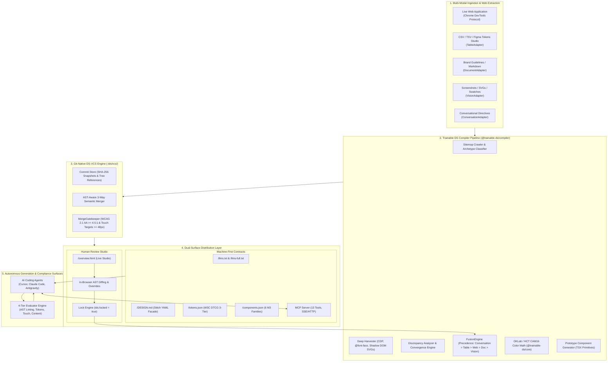

# Trainable DS — Technical Architecture Specification & Replication Manual

**Document Version:** 1.7.0  
**Target Audience:** Lead System Architects, Core Engineers, Compiler Engineers, AI Tooling Engineers  
**Classification:** Authoritative Technical Specification  
**Status:** Certified Implementation Standard  
**Published:** September 2026  

---

## Table of Contents

1. [Executive Summary & High-Level System Topology](#1-executive-summary--high-level-system-topology)
2. [Dual-Surface Architecture & Machine-First Contracts](#2-dual-surface-architecture--machine-first-contracts)
   - 2.1 [The Agent-First Contract Layer](#21-the-agent-first-contract-layer)
   - 2.2 [The Human-in-the-Loop Review Studio](#22-the-human-in-the-loop-review-studio)
   - 2.3 [Bidirectional Synchronization & Lock Semantics](#23-bidirectional-synchronization--lock-semantics)
3. [Core Token Hierarchy & Perceptual Color Science (`@trainable-ds/core`)](#3-core-token-hierarchy--perceptual-color-science-trainable-dscore)
   - 3.1 [W3C DTCG 3-Tier Architecture](#31-w3c-dtcg-3-tier-architecture)
   - 3.2 [HCT Color Space & OKLab Perceptual Math](#32-hct-color-space--oklab-perceptual-math)
   - 3.3 [M3 14-Tone Tonal Palettes](#33-m3-14-tone-tonal-palettes)
   - 3.4 [The 47 Semantic Color Roles](#34-the-47-semantic-color-roles)
   - 3.5 [Contrast Ratio Mathematics & On-Color Pairings](#35-contrast-ratio-mathematics--on-color-pairings)
   - 3.6 [15-Tier Typescale Ladder](#36-15-tier-typescale-ladder)
   - 3.7 [Spatial Quantum, Shapes, State Layers & Elevation](#37-spatial-quantum-shapes-state-layers--elevation)
4. [Web Extractor & Deep Visual Alignment (`@trainable-ds/compiler/aligner`)](#4-web-extractor--deep-visual-alignment-trainable-dscompileraligner)
   - 4.1 [Sitemap Crawler & Archetype Classification](#41-sitemap-crawler--archetype-classification)
   - 4.2 [Deep Asset Harvester & Shadow DOM Piercing](#42-deep-asset-harvester--shadow-dom-piercing)
   - 4.3 [Headless Chrome CDP Runner](#43-headless-chrome-cdp-runner)
   - 4.4 [Runtime Computed Style Sampling](#44-runtime-computed-style-sampling)
   - 4.5 [Discrepancy Analyzer & Convergence Formula](#45-discrepancy-analyzer--convergence-formula)
   - 4.6 [Iterative Visual Alignment Loop](#46-iterative-visual-alignment-loop)
5. [Universal Multi-Modal Ingestion Engine (`@trainable-ds/compiler/ingest`)](#5-universal-multi-modal-ingestion-engine-trainable-dscompileringest)
   - 5.1 [Adapter Interface & Provenance Metadata](#51-adapter-interface--provenance-metadata)
   - 5.2 [TableAdapter: Tabular & Tokens Studio JSON](#52-tableadapter-tabular--tokens-studio-json)
   - 5.3 [DocumentAdapter: Markdown Brand Guidelines & NLP](#53-documentadapter-markdown-brand-guidelines--nlp)
   - 5.4 [VisionAdapter: Spatial Quantum & Color Clustering](#54-visionadapter-spatial-quantum--color-clustering)
   - 5.5 [ConversationAdapter: Natural Language Compilation](#55-conversationadapter-natural-language-compilation)
   - 5.6 [FusionEngine: Source Precedence & Reconciliation](#56-fusionengine-source-precedence--reconciliation)
6. [Git-Native Design System VCS (DS-VCS) (`@trainable-ds/compiler/vcs`)](#6-git-native-design-system-vcs-ds-vcs-trainable-dscompilervcs)
   - 6.1 [Storage Topology & Data Format](#61-storage-topology--data-format)
   - 6.2 [Cryptographic Commit & Snapshot Hashing](#62-cryptographic-commit--snapshot-hashing)
   - 6.3 [SemanticMerger: AST-Aware 3-Way Merge](#63-semanticmerger-ast-aware-3-way-merge)
   - 6.4 [MergeGatekeeper: Automated Accessibility & Quality Gates](#64-mergegatekeeper-automated-accessibility--quality-gates)
7. [Prototype Component Library & Astryx JIT Agent Parity](#7-prototype-component-library--astryx-jit-agent-parity)
   - 7.1 [Component Library Generator](#71-component-library-generator)
   - 7.2 [Authoritative Upstream Fallbacks](#72-authoritative-upstream-fallbacks)
   - 7.3 [JIT CLI & MCP Component Retrieval](#73-jit-cli--mcp-component-retrieval)
8. [4-Tier Compliance Evaluator Engine (`@trainable-ds/evaluator`)](#8-4-tier-compliance-evaluator-engine-trainable-dsevaluator)
   - 8.1 [Evaluation Pipeline Architecture](#81-evaluation-pipeline-architecture)
   - 8.2 [Tier 1: Static Token Audit](#82-tier-1-static-token-audit)
   - 8.3 [Tier 2: Component Reuse & On-Color Pairing](#83-tier-2-component-reuse--on-color-pairing)
   - 8.4 [Tier 3: Touch Targets & Bidirectional RTL](#84-tier-3-touch-targets--bidirectional-rtl)
   - 8.5 [Tier 4: Semantic Content & Sentence-Case](#85-tier-4-semantic-content--sentence-case)
   - 8.6 [Scoring Algorithm & Certification Gate](#86-scoring-algorithm--certification-gate)
9. [Step-by-Step Engineering Replication Guide](#9-step-by-step-engineering-replication-guide)
   - [Step 1: Monorepo Scaffold & Core Type Definitions](#step-1-monorepo-scaffold--core-type-definitions)
   - [Step 2: Implement OKLab & HCT Perceptual Color Math](#step-2-implement-oklab--hct-perceptual-color-math)
   - [Step 3: Build the Headless CDP Extractor & Deep Harvester](#step-3-build-the-headless-cdp-extractor--deep-harvester)
   - [Step 4: Construct Ingestion Adapters & Fusion Engine](#step-4-construct-ingestion-adapters--fusion-engine)
   - [Step 5: Implement DS-VCS, 3-Way Semantic Merger & Gatekeeper](#step-5-implement-ds-vcs-3-way-semantic-merger--gatekeeper)
   - [Step 6: Build Component Library Generator & Astryx JIT Tools](#step-6-build-component-library-generator--astryx-jit-tools)
   - [Step 7: Wire 4-Tier Evaluator, MCP Server & Review Studio](#step-7-wire-4-tier-evaluator-mcp-server--review-studio)
10. [Reference Implementation File Map & API Dictionary](#10-reference-implementation-file-map--api-dictionary)

---

## 1. Executive Summary & High-Level System Topology

### 1.1 The Enterprise Problem
Modern enterprise software engineering faces a severe systemic failure at the intersection of AI code generation and design systems:
1. **Context Window Saturation vs. Hallucination:** Ingesting 50,000 lines of design tokens or complete Storybooks into an LLM's context window exhausts token limits and triggers attention drift. Conversely, providing bare natural language guidelines results in models hallucinating arbitrary hex codes (`#2563eb`), ungrounded spacing units (`p-[13px]`), non-standard touch targets ($< 48\text{px}$), and fragmented component primitives.
2. **Configuration Friction:** Engineers spend hours managing CLI wrappers, writing `.cursorrules`, configuring MCP server JSONs, and synchronizing design system repositories across distributed surfaces.
3. **Decoupled Governance:** When design tokens are updated in code or Figma, AI generation surfaces have no automated synchronization mechanism, resulting in visual drift across repositories.

### 1.2 The Trainable DS Paradigm
**Trainable DS** solves this by establishing an **Agent-Native, Closed-Loop Design System Compiler and Governance Platform**. It functions on three fundamental tenets:
1. **Machine-First Authoritative Contracts:** All design decisions are compiled into structured, context-window-optimized artifacts (`llms.txt`, `DESIGN.md`, `tokens.json`, `components.json`, `fonts.json`, `icons.json`).
2. **Dual-Surface Human-in-the-Loop Governance:** AI agents operate autonomously against certified contracts, while human designers and tech leads review, override, and lock decisions using an interactive Visual Review Studio (`overview.html`) featuring in-browser AST diffing.
3. **Closed-Loop Self-Correction:** Generation is backed by a 4-Tier Evaluator (`@trainable-ds/evaluator`) accessible via CLI, REST API, or Model Context Protocol (MCP), allowing agents to evaluate their code, parse diagnostic feedback, and self-patch until certified at 100% compliance.

### 1.3 High-Level System Topology



---

## 2. Dual-Surface Architecture & Machine-First Contracts

### 2.1 The Agent-First Contract Layer
AI coding models (such as Claude 3.5 Sonnet, GPT-4o, and Gemini 1.5 Pro) do not consume visual documentation effectively. They require concise, unambiguous, machine-readable contracts with high signal-to-noise ratios. Trainable DS emits a 6-asset contract bundle:

```
workspace-root/
├── llms.txt               # Executive Agent Discovery & Extraction/Generation Protocol
├── llms-full.txt          # Complete Zero-Shot Context Injection Bundle
├── DESIGN.md              # Enhanced Stitch Facade: YAML Frontmatter + "The Why" Rationale
├── tokens.json            # Authoritative W3C DTCG 3-Tier Design Tokens
├── components.json        # Component Contract Manifest (Anatomy, Props, A11y, Rules)
├── fonts.json             # Harvested Font Families, @font-face Blocks & CDN WOFF2 URLs
├── icons.json             # Harvested SVG Vector Library & Metadata
└── .well-known/mcp.json   # Model Context Protocol Discovery Manifest
```

#### The `DESIGN.md` Stitch Facade Structure
The `DESIGN.md` file marries structured machine tokens with natural language design intent ("The Why"):
```markdown
---
schema: trainable-ds/v1.7
name: Enterprise Design System
version: 1.0.0
mode: dual-scheme
framework: react-tailwind
tokens:
  system:
    color:
      light:
        primary: "#0066cc"
        onPrimary: "#ffffff"
        surface: "#f8f9fa"
        onSurface: "#1a1a1a"
        surfaceContainer: "#ededf0"
        surfaceContainerHigh: "#e2e4e8"
        outline: "#737373"
      dark:
        primary: "#99ccff"
        onPrimary: "#003366"
        surface: "#121212"
        onSurface: "#e6e6e6"
        surfaceContainer: "#1e1e1e"
        surfaceContainerHigh: "#2d2d2d"
        outline: "#8c8c8c"
    typescale:
      headlineMedium: { font: Inter, size: 28px, line: 36px, weight: 400 }
      bodyLarge: { font: Inter, size: 16px, line: 24px, weight: 400 }
      labelLarge: { font: Inter, size: 14px, line: 20px, weight: 500 }
---

# Design System: Enterprise Design System

## 1. Visual Philosophy & Semantic Intent ("The Why")
- Surfaces rely on the 5-level Surface Container hierarchy to establish depth without drop-shadow clutter.
- The Primary color is strictly reserved for user focus and core calls-to-action.
- An 8dp spatial quantum grid dictates all layout bounds, margins, and component paddings.

## 2. Core Component Library (Certified Contracts)
*Never author ad-hoc buttons or form controls. Compose strictly from certified primitives.*
```

### 2.2 The Human-in-the-Loop Review Studio
While machines generate and consume contracts, human design leads retain ultimate editorial authority. Trainable DS provides `overview.html`, an interactive single-page application compiled directly into `firebase/public/overview.html` (or served locally via `tds serve`):
- **Live Color & Geometry Overrides:** Visual inputs allow editing primary colors, container background values, padding scales, and border-radius models (e.g. switching between a 9999px full pill and an 8px rounded rectangle).
- **Executable Component Studio:** Interactive preview canvas rendering the TSX component primitives directly with variant toggles (`primary`, `secondary`, `outlined`, `elevated`), slot controls, and live property inspection.
- **In-Browser AST Diffing:** Tracks pending overrides against the extracted baseline in memory, computing the exact JSON patch before serialization.

### 2.3 Bidirectional Synchronization & Lock Semantics
When a human modifies an extracted token or component in `overview.html` and saves:
1. The token's `$extensions` block is stamped with `"tds:locked": true`.
2. The payload is sent to the local CLI daemon or Firebase backend (`POST /api/v1/tokens/override`).
3. The `FusionEngine` and `reconcileTokensAndComponents()` pipeline enforce lock immunity: subsequent web crawls, CSV ingestions, or visual alignment loops are strictly prohibited from mutating locked keys unless explicitly forced with `--force`.

```json
{
  "comp.button.shape.corner": {
    "$value": "9999px",
    "$type": "dimension",
    "$description": "Button corner radius locked by human reviewer",
    "$extensions": {
      "tds:locked": true,
      "tds:confidence": 1.0,
      "tds:occurrences": 1,
      "tds:inferredFrom": "human-reviewer-studio"
    }
  }
}
```

---

## 3. Core Token Hierarchy & Perceptual Color Science (`@trainable-ds/core`)

### 3.1 W3C DTCG 3-Tier Architecture
Trainable DS strictly implements the W3C Design Tokens Community Group (DTCG) specification across three distinct architectural tiers:

```
┌─────────────────────────────────────────────────────────────┐
│ 1. REFERENCE TOKENS (ref.palette.*)                         │
│ Raw, unassigned primitive values derived from color space   │
│ Example: ref.palette.primary.40 = "#0066cc"                │
└──────────────────────────────┬──────────────────────────────┘
                               │ maps to
                               ▼
┌─────────────────────────────────────────────────────────────┐
│ 2. SYSTEM SEMANTIC TOKENS (sys.color.*, sys.spacing.*)      │
│ Contextual design tokens defining intent and theme modes    │
│ Example: sys.color.primary = "{ref.palette.primary.40}"    │
│ Example: sys.color.surface-container = "#dededf"            │
└──────────────────────────────┬──────────────────────────────┘
                               │ maps to
                               ▼
┌─────────────────────────────────────────────────────────────┐
│ 3. COMPONENT TOKENS (comp.button.*, comp.card.*)            │
│ Granular, component-scoped bindings                         │
│ Example: comp.button.container.color = "{sys.color.primary}"│
│ Example: comp.button.shape.corner = "9999px"                │
└─────────────────────────────────────────────────────────────┘
```

The TypeScript definition for every token is governed by `DtcgTokenSchema` in [`packages/core/src/tokens/dtcg.ts`](file:///Users/justus/Desktop/Merchant/Design%20Systems%204%20LLM/Design%20Systems%20for%20LLMs/packages/core/src/tokens/dtcg.ts):
```typescript
export interface DtcgToken<T = string | number | Record<string, unknown>> {
  $value: T;
  $type: "color" | "dimension" | "fontFamily" | "fontWeight" | "duration" | "cubicBezier" | "number" | "shadow" | "composite";
  $description?: string;
  $extensions?: {
    "tds:locked"?: boolean;
    "tds:confidence"?: number;
    "tds:occurrences"?: number;
    "tds:inferredFrom"?: string;
  };
}
```

### 3.2 HCT Color Space & OKLab Perceptual Math
Standard sRGB color mathematics fail human perceptual reality: green appears vastly brighter to the human eye than blue at the same nominal mathematical lightness ($L=50\%$). Material Design 3 solves this using **HCT (Hue, Chroma, Tone)** based on the CAM16 color appearance model and CIELAB/OKLab.

In `@trainable-ds/core/src/hct/palette.ts`, Trainable DS implements an analytical bridge between sRGB, Linear sRGB, and OKLab:

#### 1. sRGB to Linear sRGB Transfer Function
For each channel $C \in \{R, G, B\}$ normalized to $[0, 1]$:
$$C_{\text{linear}} = \begin{cases} \frac{C}{12.92} & \text{if } C \le 0.04045 \\ \left(\frac{C + 0.055}{1.055}\right)^{2.4} & \text{if } C > 0.04045 \end{cases}$$

#### 2. Linear sRGB to OKLab Transformation
Linear RGB values are projected into cone responses ($L, M, S$) using the matrix $M_1$:
$$\begin{bmatrix} L \\ M \\ S \end{bmatrix} = \begin{bmatrix} 0.4122214708 & 0.5363325363 & 0.0514459929 \\ 0.2119034982 & 0.6806995451 & 0.1073969566 \\ 0.0883024619 & 0.2817188376 & 0.6299787005 \end{bmatrix} \begin{bmatrix} R_{\text{linear}} \\ G_{\text{linear}} \\ B_{\text{linear}} \end{bmatrix}$$

Non-linear compression is applied via cube root:
$$L' = \sqrt[3]{L}, \quad M' = \sqrt[3]{M}, \quad S' = \sqrt[3]{S}$$

The compressed cone responses are transformed into OKLab coordinates $(L_{\text{ok}}, a_{\text{ok}}, b_{\text{ok}})$ using matrix $M_2$:
$$\begin{bmatrix} L_{\text{ok}} \\ a_{\text{ok}} \\ b_{\text{ok}} \end{bmatrix} = \begin{bmatrix} 0.2104542553 & 0.7936177850 & -0.0040720468 \\ 1.9779984951 & -2.4285922050 & 0.4505937099 \\ 0.0259040371 & 0.7827717662 & -0.8086757660 \end{bmatrix} \begin{bmatrix} L' \\ M' \\ S' \end{bmatrix}$$

### 3.3 M3 14-Tone Tonal Palettes
Given an arbitrary seed hex color (e.g. brand primary `#3c485c`), `generateTonalPalette(seedHex, paletteName)` generates an authoritative 14-tone tonal ladder across tones:
$$\text{Tones} \in [0, 10, 20, 30, 40, 50, 60, 70, 80, 90, 95, 98, 99, 100]$$

Where:
- Tone 0 is absolute black (`#000000`)
- Tone 100 is absolute white (`#ffffff`)
- Tones 10 through 99 map target tone $T$ to perceptual lightness $L_{\text{target}} = \frac{T}{100}$. Chroma dampening is applied near luminance extremes using a sinusoidal curve:
  $$\text{ChromaMultiplier} = \min\left(1.0, \, \sin\left(\frac{T}{100} \pi\right) \times 1.2\right)$$

### 3.4 The 47 Semantic Color Roles
In [`packages/core/src/tokens/m3-colors.ts`](file:///Users/justus/Desktop/Merchant/Design%20Systems%204%20LLM/Design%20Systems%20for%20LLMs/packages/core/src/tokens/m3-colors.ts), the `M3ColorSchemeRolesSchema` governs exactly 47 semantic roles across light and dark modes:

| Category | Roles Count | Exact Token Identifiers |
| :--- | :---: | :--- |
| **Primary Accent Group** | 4 | `primary`, `onPrimary`, `primaryContainer`, `onPrimaryContainer` |
| **Secondary Accent Group** | 4 | `secondary`, `onSecondary`, `secondaryContainer`, `onSecondaryContainer` |
| **Tertiary Accent Group** | 4 | `tertiary`, `onTertiary`, `tertiaryContainer`, `onTertiaryContainer` |
| **Error Feedback Group** | 4 | `error`, `onError`, `errorContainer`, `onErrorContainer` |
| **Surface Hierarchy** | 11 | `surface`, `onSurface`, `surfaceVariant`, `onSurfaceVariant`, `surfaceDim`, `surfaceBright`, `surfaceContainerLowest`, `surfaceContainerLow`, `surfaceContainer`, `surfaceContainerHigh`, `surfaceContainerHighest` |
| **Fixed Accent Roles** | 12 | `primaryFixed`, `primaryFixedDim`, `onPrimaryFixed`, `onPrimaryFixedVariant`, `secondaryFixed`, `secondaryFixedDim`, `onSecondaryFixed`, `onSecondaryFixedVariant`, `tertiaryFixed`, `tertiaryFixedDim`, `onTertiaryFixed`, `onTertiaryFixedVariant` |
| **Utilities & Inverses** | 8 | `outline`, `outlineVariant`, `inverseSurface`, `inverseOnSurface`, `inversePrimary`, `shadow`, `scrim`, `surfaceTint` |
| **Total Semantic Roles** | **47** | Complete, non-lossy M3 specification |

### 3.5 Contrast Ratio Mathematics & On-Color Pairings
To satisfy WCAG 2.1 Level AA accessibility standards, text and interactive glyphs must achieve guaranteed relative luminance contrast against their background.

#### Relative Luminance Formula
For any sRGB color normalized to $[0, 1]$:
$$R_{\text{linear}} = \begin{cases} \frac{R}{12.92} & R \le 0.03928 \\ \left(\frac{R + 0.055}{1.055}\right)^{2.4} & R > 0.03928 \end{cases}$$
$$L = 0.2126 R_{\text{linear}} + 0.7152 G_{\text{linear}} + 0.0722 B_{\text{linear}}$$

#### Contrast Ratio Equation
Given relative luminances $L_1$ and $L_2$ where $L_1 > L_2$:
$$\text{Contrast Ratio} = \frac{L_1 + 0.05}{L_2 + 0.05}$$

- **Standard Text / Interactive Elements:** Must achieve $\ge 4.5:1$
- **Large Text ($\ge 24\text{px}$ or $\ge 18.5\text{px}$ bold):** Must achieve $\ge 3.0:1$
- **Mandatory M3 On-Color Pairing Rules:**
  - `sys.color.primary` must strictly pair with `sys.color.onPrimary`
  - `sys.color.surface-container` must strictly pair with `sys.color.onSurface`
  - `sys.color.error` must strictly pair with `sys.color.onError`

### 3.6 15-Tier Typescale Ladder
Defined in [`packages/core/src/tokens/m3-typescale.ts`](file:///Users/justus/Desktop/Merchant/Design%20Systems%204%20LLM/Design%20Systems%20for%20LLMs/packages/core/src/tokens/m3-typescale.ts), the typescale comprises 5 functional categories $\times$ 3 scales (Large, Medium, Small):

```
┌──────────────┬──────────────────┬──────────┬─────────────┬────────┬──────────┐
│ Category     │ Tier             │ Font Size│ Line Height │ Weight │ Tracking │
├──────────────┼──────────────────┼──────────┼─────────────┼────────┼──────────┤
│ Display      │ displayLarge     │ 57px     │ 64px        │ 400    │ -0.25px  │
│              │ displayMedium    │ 45px     │ 52px        │ 400    │ 0px      │
│              │ displaySmall     │ 36px     │ 44px        │ 400    │ 0px      │
├──────────────┼──────────────────┼──────────┼─────────────┼────────┼──────────┤
│ Headline     │ headlineLarge    │ 32px     │ 40px        │ 400    │ 0px      │
│              │ headlineMedium   │ 28px     │ 36px        │ 400    │ 0px      │
│              │ headlineSmall    │ 24px     │ 32px        │ 400    │ 0px      │
├──────────────┼──────────────────┼──────────┼─────────────┼────────┼──────────┤
│ Title        │ titleLarge       │ 22px     │ 28px        │ 500    │ 0px      │
│              │ titleMedium      │ 16px     │ 24px        │ 500    │ +0.15px  │
│              │ titleSmall       │ 14px     │ 20px        │ 500    │ +0.10px  │
├──────────────┼──────────────────┼──────────┼─────────────┼────────┼──────────┤
│ Body         │ bodyLarge        │ 16px     │ 24px        │ 400    │ +0.50px  │
│              │ bodyMedium       │ 14px     │ 20px        │ 400    │ +0.25px  │
│              │ bodySmall        │ 12px     │ 16px        │ 400    │ +0.40px  │
├──────────────┼──────────────────┼──────────┼─────────────┼────────┼──────────┤
│ Label        │ labelLarge       │ 14px     │ 20px        │ 500    │ +0.10px  │
│              │ labelMedium      │ 12px     │ 16px        │ 500    │ +0.50px  │
│              │ labelSmall       │ 11px     │ 16px        │ 500    │ +0.50px  │
└──────────────┴──────────────────┴──────────┴─────────────┴────────┴──────────┘
```

### 3.7 Spatial Quantum, Shapes, State Layers & Elevation
1. **Spatial Quantum:** Base unit is 8dp (with a 4dp half-step). All layout paddings, margins, gaps, and heights must be $n \times 8\text{px}$ or $n \times 4\text{px}$.
2. **7-Point Shape Scale:**
   - `cornerNone`: 0px
   - `cornerExtraSmall`: 4px
   - `cornerSmall`: 8px
   - `cornerMedium`: 12px
   - `cornerLarge`: 16px
   - `cornerExtraLarge`: 28px
   - `cornerFull`: 9999px (Full Pill)
3. **Interaction State Layers:** Semi-transparent overlays using the paired `on-*` color:
   - `hover`: 0.08 (8% overlay)
   - `focus`: 0.10 (10% overlay) with 3px ring and 2px offset
   - `pressed`: 0.10 (10% overlay + ripple)
   - `dragged`: 0.16 (16% overlay)
   - `disabledContent`: 0.38 (38% opacity for text & icons)
   - `disabledContainer`: 0.12 (12% opacity for container fill)
4. **Elevation & Surface Tinting:** Elevation does not rely solely on drop shadows. Material Design 3 tints surfaces with a percentage of the `primary` color token:
   - `level0`: 0dp, 0% tint, shadow: none
   - `level1`: 1dp, 5% tint, shadow: 0px 1px 3px 1px rgba(0,0,0,0.15)
   - `level2`: 3dp, 8% tint, shadow: 0px 2px 6px 2px rgba(0,0,0,0.15)
   - `level3`: 6dp, 11% tint, shadow: 0px 4px 8px 3px rgba(0,0,0,0.15)
   - `level4`: 8dp, 12% tint, shadow: 0px 6px 10px 4px rgba(0,0,0,0.15)
   - `level5`: 12dp, 14% tint, shadow: 0px 8px 12px 6px rgba(0,0,0,0.15)

---

## 4. Web Extractor & Deep Visual Alignment (`@trainable-ds/compiler/aligner`)

### 4.1 Sitemap Crawler & Archetype Classification
Extracting a design system from a single homepage produces biased results (missing form controls, error states, and product listings). The `SitemapCrawler` in [`packages/compiler/src/aligner/sitemap-crawler.ts`](file:///Users/justus/Desktop/Merchant/Design%20Systems%204%20LLM/Design%20Systems%20for%20LLMs/packages/compiler/src/aligner/sitemap-crawler.ts) recursively scans `/sitemap.xml` and in-page navigation anchors, categorizing discovered pages into 5 structural archetypes:

```
                          Target URL (Root)
                                 │
         ┌───────────────────────┴───────────────────────┐
         ▼                                               ▼
  Fetch /sitemap.xml                           In-Page Anchor Crawl
  (XML Parser)                                 (DOM Navigation Links)
         │                                               │
         └───────────────────────┬───────────────────────┘
                                 ▼
                     Archetype Classifier Engine
                                 │
     ┌───────────────┬───────────┴───┬───────────────┬───────────────┐
     ▼               ▼               ▼               ▼               ▼
   home           listing          detail          form           content
  (Root)       (Catalog/Grid)  (Product/Item)  (Configurator)  (News/Stories)
```

The heuristic classifier function `classifyPageArchetype(url, title, label)` detects URL keywords (`finder`, `configurator`, `checkout`, `models`, `article`) and weights discovered pages to select the top candidate across each archetype for multi-page alignment.

### 4.2 Deep Asset Harvester & Shadow DOM Piercing
Traditional web crawlers cannot access styles encapsulated within Web Components. The `DeepAssetsHarvester` in [`packages/compiler/src/aligner/assets-harvester.ts`](file:///Users/justus/Desktop/Merchant/Design%20Systems%204%20LLM/Design%20Systems%20for%20LLMs/packages/compiler/src/aligner/assets-harvester.ts) executes an in-page script that traverses both the light DOM and open shadow roots:

```typescript
function harvestIconsFromRoot(root: Document | ShadowRoot) {
  if (!root) return;
  const candidates = root.querySelectorAll('svg, ds-icon, [class*="icon"], [data-icon]');
  candidates.forEach(el => {
    let svgEl = el.tagName.toLowerCase() === 'svg' ? el : null;
    // Pierce Shadow Root for custom web components (e.g., <ds-icon>)
    if (!svgEl && el.shadowRoot) {
      svgEl = el.shadowRoot.querySelector('svg');
    }
    if (svgEl) {
      // Extract viewBox, paths, geometry, and deduplicate via hash
    }
  });

  // Recursively inspect child shadow roots
  root.querySelectorAll('*').forEach(child => {
    if (child.shadowRoot) harvestIconsFromRoot(child.shadowRoot);
  });
}
```

Simultaneously, the harvester parses `document.styleSheets` for `CSSFontFaceRule` entries, extracting `@font-face` blocks, weights (`100`–`900`), font-display modes, and raw CDN `.woff2` URLs into `fonts.json`.

### 4.3 Headless Chrome CDP Runner
The `CdpRunner` in [`packages/compiler/src/aligner/cdp-runner.ts`](file:///Users/justus/Desktop/Merchant/Design%20Systems%204%20LLM/Design%20Systems%20for%20LLMs/packages/compiler/src/aligner/cdp-runner.ts) interfaces with Google Chrome over the Chrome DevTools Protocol:
1. Detects local Chrome binaries on macOS (`/Applications/Google Chrome.app/...`) and Linux (`/usr/bin/google-chrome`).
2. Checks for an active debugger on port 9222 via `http://127.0.0.1:9222/json/version`.
3. If absent, spawns Chrome with flags: `--remote-debugging-port=9222`, `--headless=new`, `--disable-gpu`, `--no-sandbox`, `--disable-dev-shm-usage`.
4. Establishes a WebSocket connection to `webSocketDebuggerUrl`, creates a target page via `Target.createTarget`, navigates, awaits DOM stability, and executes runtime script evaluation via `Runtime.evaluate`.

### 4.4 Runtime Computed Style Sampling
The in-page harvester executes a sampling pass over all interactive and structural DOM nodes:
- Resolves `window.getComputedStyle(el)` for `backgroundColor`, `color`, `borderRadius`, `padding`, `fontFamily`, `fontSize`, `fontWeight`, `lineHeight`, and `boxShadow`.
- Evaluates whether elements exhibit pill geometry:
  $$\text{isPill} = \left(\text{borderRadius} \ge 9999\text{px}\right) \lor \left(\text{borderRadius} \ge \frac{\text{elementHeight}}{2} - 1\right)$$

### 4.5 Discrepancy Analyzer & Convergence Formula
The `analyzeDrift()` engine in [`packages/compiler/src/aligner/discrepancy-analyzer.ts`](file:///Users/justus/Desktop/Merchant/Design%20Systems%204%20LLM/Design%20Systems%20for%20LLMs/packages/compiler/src/aligner/discrepancy-analyzer.ts) audits observed source-of-truth elements against extracted tokens:

#### Color Delta Calculation
Euclidean distance in sRGB normalized to $[0, 100]$:
$$\Delta_{\text{color}} = \frac{\sqrt{(R_1 - R_2)^2 + (G_1 - G_2)^2 + (B_1 - B_2)^2}}{\sqrt{255^2 \times 3}} \times 100$$

#### Category Scoring
Penalties are subtracted from a baseline of 100:
- **Geometry Penalties:** Shape mismatch (e.g. Pill vs Rectangle): $-35$; Corner radius drift $> 4\text{px}$: $-15$; Padding drift: $-20$.
- **Color Penalties:** Color distance $\Delta_{\text{color}} > 15$: $-25$.
- **Material Penalties:** Opacity / alpha drift $> 0.20$: $-25$.
- **Typography Penalties:** Font family mismatch: $-25$; Font weight drift $> 150$: $-15$.

#### Composite Convergence Score
$$\text{CompositeScore} = \text{clamp}\Big(\text{Geometry} \times 0.35 + \text{Color} \times 0.30 + \text{Typography} \times 0.20 + \text{Material} \times 0.15\Big)$$
Convergence is achieved when $\text{CompositeScore} \ge \text{Threshold}$ (default: $95\%$).

### 4.6 Iterative Visual Alignment Loop
The `VisualLoopRunner` in [`packages/compiler/src/aligner/visual-loop-runner.ts`](file:///Users/justus/Desktop/Merchant/Design%20Systems%204%20LLM/Design%20Systems%20for%20LLMs/packages/compiler/src/aligner/visual-loop-runner.ts) executes up to $N$ iterations (default: 3):
1. Samples source of truth via CDP.
2. Samples extracted design system template.
3. Computes `DriftReport`.
4. If converged or score delta $< 0.5\%$ (diminishing returns), terminates.
5. Invokes `reconcileTokensAndComponents()` to apply patches to `tokens.json` and `components.json`.
6. Preserves all tokens marked `tds:locked: true`.

---

## 5. Universal Multi-Modal Ingestion Engine (`@trainable-ds/compiler/ingest`)

### 5.1 Adapter Interface & Provenance Metadata
Every ingestion source is modeled via the `IngestAdapter<TInput>` interface:
```typescript
export interface IngestAdapter<TInput = unknown> {
  readonly name: string;
  readonly sourceType: "web" | "vision" | "document" | "table" | "conversation";
  ingest(input: TInput, options?: Record<string, unknown>): Promise<IngestResult>;
}

export interface ProvenanceRecord {
  source: string;
  sourceType: "web" | "vision" | "document" | "table" | "conversation";
  confidence: number;
  timestamp: string;
  method?: string;
  notes?: string;
}
```

### 5.2 TableAdapter: Tabular & Tokens Studio JSON
Located in [`packages/compiler/src/ingest/table-adapter.ts`](file:///Users/justus/Desktop/Merchant/Design%20Systems%204%20LLM/Design%20Systems%20for%20LLMs/packages/compiler/src/ingest/table-adapter.ts):
- **Delimited Parser:** Ingests CSV and TSV with automatic delimiter detection (comma vs. semicolon vs. tab). Dynamically maps column headers (`token_name`, `value`, `type`, `tier`, `description`).
- **Figma Tokens Studio JSON Walker:** Recursively traverses Figma Tokens Studio nested token sets, identifying DTCG token nodes containing `value` or `$value`, coercing types, and inferring the 3-tier hierarchy (`ref`, `sys`, `comp`).

### 5.3 DocumentAdapter: Markdown Brand Guidelines & NLP
Located in [`packages/compiler/src/ingest/document-adapter.ts`](file:///Users/justus/Desktop/Merchant/Design%20Systems%204%20LLM/Design%20Systems%20for%20LLMs/packages/compiler/src/ingest/document-adapter.ts):
- Parses markdown brand guidelines, extracting key-value color mappings (`Primary: #0066cc`, `Surface: #1e1e1e`).
- Extracts font families from text like `"Primary typography is Inter with secondary font Roboto"`.
- Uses regular expressions to extract DOs, DONTs, and guidelines into `GuidelinePatch` objects with severity ratings (`CRITICAL`, `HIGH`, `MEDIUM`).

### 5.4 VisionAdapter: Spatial Quantum & Color Clustering
Located in [`packages/compiler/src/ingest/vision-adapter.ts`](file:///Users/justus/Desktop/Merchant/Design%20Systems%204%20LLM/Design%20Systems%20for%20LLMs/packages/compiler/src/ingest/vision-adapter.ts):
- **Color Clustering:** Parses sampled hex codes and SVG fill/stroke attributes into RGB and luminance vectors. Sorts colors by saturation to identify vibrant brand primaries, and clusters low-saturation values into background and surface hierarchies.
- **Spatial Quantum Inference:** Analyzes observed layout and SVG dimensions. Computes divisibility counts against modulo 4 and modulo 8:
  $$\text{Quantum} = \begin{cases} 8\text{px} & \text{if } \frac{\text{Count}(d \pmod 8 == 0)}{\text{Total}} \ge 0.40 \\ 4\text{px} & \text{otherwise} \end{cases}$$
- **Corner Radius Median:** Extracts corner radii from detected shapes and SVG `rx`/`ry` attributes, calculating the statistical median as `sys.shape.corner.base`.

### 5.5 ConversationAdapter: Natural Language Compilation
Located in [`packages/compiler/src/ingest/conversation-adapter.ts`](file:///Users/justus/Desktop/Merchant/Design%20Systems%204%20LLM/Design%20Systems%20for%20LLMs/packages/compiler/src/ingest/conversation-adapter.ts):
- Compiles conversational instructions (e.g., *"Change primary color to #008080 and make buttons pill-shaped"*) into structured `TokenPatch` and `ComponentPatch` records.
- Parses color directives, font declarations, spacing overrides, lock commands (*"Lock the primary button color"*), and authoritative library bindings.

### 5.6 FusionEngine: Source Precedence & Reconciliation
Located in [`packages/compiler/src/ingest/fusion.ts`](file:///Users/justus/Desktop/Merchant/Design%20Systems%204%20LLM/Design%20Systems%20for%20LLMs/packages/compiler/src/ingest/fusion.ts):
When multiple adapters yield patches, the `FusionEngine` resolves them using an explicit mathematical precedence order:

$$\text{Precedence: } \text{conversation (50)} > \text{table (40)} > \text{web (30)} > \text{document (20)} > \text{vision (10)}$$

Patches from higher-priority sources overwrite lower-priority sources. However, if an existing token has `tds:locked: true`, it cannot be overwritten by any source unless `options.force = true`. Complete provenance history is maintained in `tokens._meta.provenance`.

---

## 6. Git-Native Design System VCS (DS-VCS) (`@trainable-ds/compiler/vcs`)

### 6.1 Storage Topology & Data Format
Trainable DS incorporates a Git-native version control system specifically designed for design systems, stored locally inside `.tds/vcs/`:

```
.tds/vcs/
├── HEAD                        # Points to active ref (e.g. "ref: refs/heads/main")
├── refs/
│   └── heads/
│       ├── main                # Plaintext SHA-256 Commit ID (12 chars)
│       ├── brand-refresh       # Plaintext SHA-256 Commit ID
│       └── experimental-dark   # Plaintext SHA-256 Commit ID
├── commits/
│   ├── a1b2c3d4e5f6.json       # CommitRecord metadata object
│   └── 9f8e7d6c5b4a.json
└── snapshots/
    ├── f7e6d5c4b3a29180.json   # Full DesignSystemSnapshot (tokens, comps, fonts, icons)
    └── 1234567890abcdef.json
```

### 6.2 Cryptographic Commit & Snapshot Hashing
In [`packages/compiler/src/vcs/store.ts`](file:///Users/justus/Desktop/Merchant/Design%20Systems%204%20LLM/Design%20Systems%20for%20LLMs/packages/compiler/src/vcs/store.ts):
1. **Snapshot Hashing:** The full snapshot JSON is hashed using SHA-256 (truncated to 16 hex characters):
   $$\text{SnapshotHash} = \text{SHA256}(\text{JSON.stringify}(\text{snapshot})).slice(0, 16)$$
2. **Commit Object Hashing:** A cryptographic payload concatenating the parent commit ID, branch name, ISO timestamp, snapshot hash, and commit message is hashed (truncated to 12 hex characters):
   $$\text{Payload} = \text{ParentId} + ":" + \text{Branch} + ":" + \text{Timestamp} + ":" + \text{SnapshotHash} + ":" + \text{Message}$$
   $$\text{CommitId} = \text{SHA256}(\text{Payload}).slice(0, 12)$$

### 6.3 SemanticMerger: AST-Aware 3-Way Merge
Unlike standard Git which merges line-by-line text and frequently breaks JSON syntax, the `SemanticMerger` in [`packages/compiler/src/vcs/semantic-merger.ts`](file:///Users/justus/Desktop/Merchant/Design%20Systems%204%20LLM/Design%20Systems%20for%20LLMs/packages/compiler/src/vcs/semantic-merger.ts) operates on abstract token paths and component schemas across three trees: `base`, `ours`, and `theirs`.

```
                    Base Ancestor (Commit X)
                           /       \
                          /         \
                         ▼           ▼
             Ours (Branch A)      Theirs (Branch B)
                         \           /
                          \         /
                           ▼       ▼
                     SemanticMerger Engine
                     ├── Token 3-Way Merge
                     ├── Component AST Merge
                     └── Lock-Aware Resolution
                               │
                               ▼
                      Merged Snapshot JSON
                      (Zero Syntax Corruption)
```

#### Merge Logic Matrix
For each token path:
- If `ours == theirs`: Clean resolution.
- If `ours == base` and `theirs != base`: Apply `theirs` (incoming change).
- If `theirs == base` and `ours != base`: Keep `ours` (local change).
- If `ours != base` and `theirs != base` and `ours != theirs`:
  - If `options.preferOurLocks == true` and `ours.isLocked == true`: Retain locked `ours` value automatically.
  - Otherwise, record a structured `TokenConflict` isolating the conflicting values.

### 6.4 MergeGatekeeper: Automated Accessibility & Quality Gates
Before any merge can be committed to the target branch, the `MergeGatekeeper` in [`packages/compiler/src/vcs/merge-gatekeeper.ts`](file:///Users/justus/Desktop/Merchant/Design%20Systems%204%20LLM/Design%20Systems%20for%20LLMs/packages/compiler/src/vcs/merge-gatekeeper.ts) evaluates the merged candidate snapshot:
1. **Contrast Gate:** Evaluates all primary, surface, background, and secondary on-color pairings. Any pair with relative luminance contrast $< 4.5:1$ generates a fatal violation and subtracts 25 points.
2. **Touch Target Gate:** Evaluates all interactive component definitions (`Button`, `IconButton`, `Select`, `Input`, `Tab`). Any interactive height $< 48\text{px}$ generates a fatal violation and subtracts 20 points.
3. **Required Tokens Gate:** Confirms existence of foundational system tokens (`sys.color.primary`, `sys.color.background`).
4. **Merge Decision:** If `violations.length > 0`, the merge is blocked unless explicitly bypassed with `--skip-gates`.

---

## 7. Prototype Component Library & Astryx JIT Agent Parity

### 7.1 Component Library Generator
The `ComponentLibraryGenerator` in [`packages/compiler/src/extractor/component-library-generator.ts`](file:///Users/justus/Desktop/Merchant/Design%20Systems%204%20LLM/Design%20Systems%20for%20LLMs/packages/compiler/src/extractor/component-library-generator.ts) emits certified, production-ready React/TSX component files configured with the exact tokens extracted from the brand:
- **`Button.tsx`:** Action primitive with 48px touch target, extracted corner radius (pill or rounded rect), variant switching (`primary`, `secondary`, `outlined`, `text`), icon slots, and active focus rings.
- **`Card.tsx`:** Containment primitive implementing the 5-level surface container hierarchy and elevation shadows.
- **`TextField.tsx`:** Text input primitive with 56px height, floating label, error state, and start/end icon adornments.
- **`Badge.tsx`, `Chip.tsx`, `Icon.tsx`:** Selection and communication primitives.

### 7.2 Authoritative Upstream Fallbacks
In enterprise scenarios, teams often bind prototype components to an upstream production library (e.g. `@mui/material`, `@chakra-ui/react`, `@radix-ui/themes`). The `components.json` contract supports authoritative bindings:

```json
{
  "Button": {
    "name": "Button",
    "path": "./components/ui/Button.tsx",
    "family": "actions",
    "authoritativeSource": {
      "type": "authoritative-library",
      "packageName": "@mui/material",
      "exportName": "Button",
      "notes": "In production builds, import Button from @mui/material"
    }
  }
}
```

### 7.3 JIT CLI & MCP Component Retrieval
To keep agent context windows lean, Trainable DS provides Just-in-Time (JIT) retrieval tools matching Meta Astryx capabilities:
- **CLI Command:** `tds doc <ComponentName>`  
  Prints the exact TSX import, prop contract, reviewer guidance notes, and executable snippet on demand.
- **MCP Tool:** `get_component_code({ component_name: "Button" })`  
  Returns the exact TSX code and author guidance directly to the calling LLM without loading the entire library into prompt memory.

---

## 8. 4-Tier Compliance Evaluator Engine (`@trainable-ds/evaluator`)

### 8.1 Evaluation Pipeline Architecture
Located in [`packages/evaluator/src/engine.ts`](file:///Users/justus/Desktop/Merchant/Design%20Systems%204%20LLM/Design%20Systems%20for%20LLMs/packages/evaluator/src/engine.ts), the evaluator performs closed-loop verification on any generated TSX, JSX, HTML, or Tailwind snippet across four sequential tiers:

```
                          Candidate Source Code
                                    │
                                    ▼
┌────────────────────────────────────────────────────────────────────────┐
│ Tier 1: Static Token Audit                                             │
│ - Flag raw hex colors (#2563eb, #ffffff)                               │
│ - Flag arbitrary non-quantum spacing (p-[13px], m-[7px])              │
└───────────────────────────────────┬────────────────────────────────────┘
                                    │
                                    ▼
┌────────────────────────────────────────────────────────────────────────┐
│ Tier 2: Component Reuse & On-Color Pair Audit                          │
│ - Flag raw HTML elements (<button>, <input>) where components exist    │
│ - Flag on-color mismatches (bg-primary with text-gray-800)             │
└───────────────────────────────────┬────────────────────────────────────┘
                                    │
                                    ▼
┌────────────────────────────────────────────────────────────────────────┐
│ Tier 3: Touch Targets & Bidirectional RTL                              │
│ - Flag interactive dimensions < 48x48px (w-8 h-8, h-[36px])            │
│ - Flag non-logical physical classes (ml-*, mr-*, pl-*, pr-*)           │
└───────────────────────────────────┬────────────────────────────────────┘
                                    │
                                    ▼
┌────────────────────────────────────────────────────────────────────────┐
│ Tier 4: Semantic Content & Sentence-Case Check                         │
│ - Flag Title Case or ALL CAPS button labels ("Save Changes")           │
│ - Enforce M3 Sentence Case ("Save changes")                            │
└───────────────────────────────────┬────────────────────────────────────┘
                                    │
                                    ▼
                     Diagnostic Report & Score (0-100)
                     Certification Threshold: Score == 100
```

### 8.2 Tier 1: Static Token Audit
- **`TDS-RAW-COLOR` (CRITICAL):** Detected via regex `#[0-9a-fA-F]{3,8}\b`. Remediates to semantic tokens (`bg-primary`, `text-on-surface`).
- **`TDS-NON-QUANTUM-SPACING` (HIGH):** Detected via regex `\b[pm][xytbl]?-\[(\d+)px\]`. Flags values not aligned to the 4px/8px scale.

### 8.3 Tier 2: Component Reuse & On-Color Pairing
- **`TDS-REINVENTED-COMPONENT` (HIGH):** Flags `<button className="...">` or `<input className="...">`, prompting agents to import `{ Button }` or `{ TextField }`.
- **`TDS-M3-ON-COLOR-MISMATCH` (CRITICAL):** Flags elements using `bg-primary` accompanied by hardcoded neutral text (`text-slate-800`), requiring `text-on-primary`.

### 8.4 Tier 3: Touch Targets & Bidirectional RTL
- **`TDS-TOUCH-TARGET-TOO-SMALL` (HIGH):** Flags buttons with explicit widths or heights $< 48\text{px}$ (`w-8`, `h-8`, `h-[36px]`).
- **`TDS-RTL-NON-LOGICAL` (LOW):** Flags physical margins (`ml-4`, `mr-2`) and requires CSS logical properties (`ms-4`, `me-2`).

### 8.5 Tier 4: Semantic Content & Sentence-Case
- **`TDS-CAPITALIZATION-NOT-SENTENCE-CASE` (MEDIUM):** Audits button label text using `isSentenceCase()`. Disallows Title Case (`"Submit Form"`) and ALL CAPS (`"SUBMIT"`), enforcing Sentence Case (`"Submit form"`).

### 8.6 Scoring Algorithm & Certification Gate
Every evaluation starts at a baseline score of 100. Points are deducted per diagnostic based on severity:
- **`CRITICAL`:** $-25$ points
- **`HIGH`:** $-15$ points
- **`MEDIUM`:** $-8$ points
- **`LOW`:** $-3$ points

$$\text{Score} = \max\left(0, \, 100 - \sum \text{Deductions}\right)$$
A snippet is **Certified Compliant** if and only if $\text{Score} == 100$ and `diagnostics.length == 0`.

---

## 9. Step-by-Step Engineering Replication Guide

This guide provides the exact 7-step process to replicate the Trainable DS platform from scratch.

### Step 1: Monorepo Scaffold & Core Type Definitions
Create a monorepo structure with pnpm or npm workspaces:

```bash
mkdir trainable-ds && cd trainable-ds
pnpm init
mkdir -p packages/{core,compiler,evaluator,cli,mcp-server}
```

In `packages/core/src/tokens/dtcg.ts`, implement the base token schema using Zod:
```typescript
import { z } from "zod";

export const DtcgTokenSchema = z.object({
  $value: z.union([z.string(), z.number(), z.record(z.unknown())]),
  $type: z.enum(["color", "dimension", "fontFamily", "fontWeight", "duration", "cubicBezier", "number", "shadow", "composite"]),
  $description: z.string().optional(),
  $extensions: z.object({
    "tds:locked": z.boolean().optional().default(false),
    "tds:confidence": z.number().optional().default(1.0),
    "tds:occurrences": z.number().optional().default(1),
    "tds:inferredFrom": z.string().optional(),
  }).passthrough().optional(),
});

export type DtcgToken<T = string | number | Record<string, unknown>> = z.infer<typeof DtcgTokenSchema> & { $value: T };
```

### Step 2: Implement OKLab & HCT Perceptual Color Math
In `packages/core/src/hct/palette.ts`, implement the sRGB to OKLab matrix multiplication and tonal ladder generator:

```typescript
export function generateTonalPalette(seedHex: string, paletteName: string): Record<string, DtcgToken<string>> {
  const baseLab = rgbToOklab(hexToRgb(seedHex));
  const tones = ["0", "10", "20", "30", "40", "50", "60", "70", "80", "90", "95", "98", "99", "100"];
  const palette: Record<string, DtcgToken<string>> = {};

  for (const t of tones) {
    const toneNum = parseInt(t, 10);
    let hex: string;
    if (toneNum === 0) hex = "#000000";
    else if (toneNum === 100) hex = "#ffffff";
    else {
      const targetL = toneNum / 100;
      const chromaDamp = Math.sin((toneNum / 100) * Math.PI);
      const rgb = oklabToRgb({
        L: targetL,
        a: baseLab.a * Math.min(1.0, chromaDamp * 1.2),
        b: baseLab.b * Math.min(1.0, chromaDamp * 1.2),
      });
      hex = rgbToHex(rgb.r, rgb.g, rgb.b);
    }
    palette[t] = {
      $value: hex,
      $type: "color",
      $description: `${paletteName} tone ${t}`,
    };
  }
  return palette;
}
```

### Step 3: Build the Headless CDP Extractor & Deep Harvester
In `packages/compiler/src/aligner/cdp-runner.ts`, connect to Chrome DevTools Protocol to harvest runtime computed styles and pierces shadow roots:

```typescript
import { spawn } from "node:child_process";

export class CdpRunner {
  async harvestUrl(url: string, port = 9222): Promise<HarvestedSystemSnapshot> {
    // 1. Launch Chrome with debugging port
    const chrome = spawn("/Applications/Google Chrome.app/Contents/MacOS/Google Chrome", [
      `--remote-debugging-port=${port}`,
      "--headless=new",
      "--no-sandbox",
      "about:blank",
    ]);

    // 2. Poll http://127.0.0.1:9222/json/version for webSocketDebuggerUrl
    const versionRes = await fetch(`http://127.0.0.1:${port}/json/version`);
    const { webSocketDebuggerUrl } = await versionRes.json();

    // 3. Connect via WebSocket, send Target.createTarget and Runtime.evaluate
    // Injected script pierces el.shadowRoot and extracts computedStyles, SVGs, and @font-face rules
    return normalizedSnapshot;
  }
}
```

### Step 4: Construct Ingestion Adapters & Fusion Engine
In `packages/compiler/src/ingest/fusion.ts`, implement source precedence and lock protection:

```typescript
export class FusionEngine {
  private static readonly PRIORITIES = {
    conversation: 50,
    table: 40,
    web: 30,
    document: 20,
    vision: 10,
  };

  fuse(existing: DesignSystemSnapshot, results: IngestResult[], options: { force?: boolean } = {}): FusionResult {
    const snapshot = structuredClone(existing);
    const locks = (snapshot.tokens._meta?.locks || {}) as Record<string, boolean>;

    const sorted = [...results].sort((a, b) => 
      (FusionEngine.PRIORITIES[a.provenance.sourceType] || 0) - (FusionEngine.PRIORITIES[b.provenance.sourceType] || 0)
    );

    for (const res of sorted) {
      for (const patch of res.tokens) {
        if (locks[patch.path] && !options.force && !patch.locked) continue; // Respect lock
        this.setNestedToken(snapshot.tokens, patch.path, patch.value, patch.type);
        if (patch.locked !== undefined) locks[patch.path] = patch.locked;
      }
    }
    return { snapshot, summary: "Fused successfully" };
  }
}
```

### Step 5: Implement DS-VCS, 3-Way Semantic Merger & Gatekeeper
In `packages/compiler/src/vcs/store.ts` and `semantic-merger.ts`, create the file-backed Git-native store and AST-aware merger:

```typescript
import crypto from "node:crypto";
import fs from "node:fs/promises";
import path from "node:path";

export class VCSStore {
  async commit(message: string, snapshot: DesignSystemSnapshot): Promise<CommitRecord> {
    const snapshotStr = JSON.stringify(snapshot, null, 2);
    const snapshotHash = crypto.createHash("sha256").update(snapshotStr).digest("hex").slice(0, 16);
    await fs.writeFile(`.tds/vcs/snapshots/${snapshotHash}.json`, snapshotStr);

    const parentId = await this.getCurrentHeadCommitId();
    const branch = await this.getCurrentBranch();
    const timestamp = new Date().toISOString();
    const commitId = crypto.createHash("sha256")
      .update(`${parentId}:${branch}:${timestamp}:${snapshotHash}:${message}`)
      .digest("hex").slice(0, 12);

    const commitRecord = { id: commitId, parentId, branch, message, timestamp, snapshotHash };
    await fs.writeFile(`.tds/vcs/commits/${commitId}.json`, JSON.stringify(commitRecord, null, 2));
    await fs.writeFile(`.tds/vcs/refs/heads/${branch}`, `${commitId}\n`);
    return commitRecord;
  }
}
```

### Step 6: Build Component Library Generator & Astryx JIT Tools
In `packages/compiler/src/extractor/component-library-generator.ts`, generate TSX code that references system tokens via CSS custom properties:

```typescript
export function generateButtonTsx(normalizedCorner: string, btnPadding: string): string {
  return `import React from "react";

export interface ButtonProps extends React.ButtonHTMLAttributes<HTMLButtonElement> {
  variant?: "primary" | "secondary" | "outlined" | "text";
}

export const Button: React.FC<ButtonProps> = ({ variant = "primary", children, style, ...props }) => {
  return (
    <button
      style={{
        minHeight: "48px",
        padding: "${btnPadding}",
        borderRadius: "${normalizedCorner}",
        display: "inline-flex",
        alignItems: "center",
        justifyContent: "center",
        ...style
      }}
      className={\`tds-btn tds-btn--\${variant}\`}
      {...props}
    >
      {children}
    </button>
  );
};
`;
}
```

### Step 7: Wire 4-Tier Evaluator, MCP Server & Review Studio
1. Wire `evaluateCode()` into `packages/evaluator/src/engine.ts`.
2. Expose the 13 tools in `packages/mcp-server/src/tools.ts` using the MCP SDK.
3. Serve `overview.html` via Express or static CDN, binding in-browser inputs to token JSON updates.

---

## 10. Reference Implementation File Map & API Dictionary

### Complete Codebase Map
- **[`packages/core/`](file:///Users/justus/Desktop/Merchant/Design%20Systems%204%20LLM/Design%20Systems%20for%20LLMs/packages/core)**
  - `src/tokens/dtcg.ts`: W3C DTCG Token schema, extensions, and helper constructors.
  - `src/hct/palette.ts`: Perceptual OKLab conversion math and 14-tone palette generator.
  - `src/tokens/m3-colors.ts`: 47 semantic color role definitions and dual-scheme schemas.
  - `src/tokens/m3-typescale.ts`: 15-tier typescale ladder and canonical defaults.
  - `src/tokens/m3-elevation.ts`: 5-level elevation system with surface tinting.
  - `src/tokens/m3-shape.ts`: 7-point shape scale and asymmetric corner geometry.
  - `src/tokens/m3-state.ts`: 6 interaction state layers and focus ring metrics.
  - `src/tokens/m3-motion.ts`: 6 easing curves and 16 duration tokens.
  - `src/components/schema.ts`: Component anatomy, prop contracts, and family schemas.
  - `src/ingest/types.ts`: Adapter interfaces, `TokenPatch`, and `ProvenanceRecord`.
  - `src/vcs/types.ts`: DS-VCS commits, snapshots, and merge conflict types.
- **[`packages/compiler/`](file:///Users/justus/Desktop/Merchant/Design%20Systems%204%20LLM/Design%20Systems%20for%20LLMs/packages/compiler)**
  - `src/aligner/sitemap-crawler.ts`: Subpage discovery and archetype classification.
  - `src/aligner/assets-harvester.ts`: Shadow DOM piercing icon and font harvester.
  - `src/aligner/cdp-runner.ts`: Headless Chrome DevTools Protocol runner.
  - `src/aligner/discrepancy-analyzer.ts`: Euclidean color and geometry drift analyzer.
  - `src/aligner/visual-loop-runner.ts`: Iterative multi-loop convergence engine.
  - `src/aligner/token-reconciler.ts`: Automated token and component patching.
  - `src/ingest/table-adapter.ts`: CSV, TSV, and Tokens Studio JSON parser.
  - `src/ingest/document-adapter.ts`: Markdown brand book and rule extractor.
  - `src/ingest/vision-adapter.ts`: Spatial quantum and color clustering engine.
  - `src/ingest/conversation-adapter.ts`: Natural language instruction compiler.
  - `src/ingest/fusion.ts`: Precedence-based multi-modal fusion engine.
  - `src/vcs/store.ts`: File-backed Git-native commit and snapshot store.
  - `src/vcs/semantic-merger.ts`: AST-aware 3-way token and component merger.
  - `src/vcs/merge-gatekeeper.ts`: WCAG AA contrast and touch target CI gatekeeper.
  - `src/extractor/component-library-generator.ts`: Production TSX component emitter.
  - `src/overview/generator.ts`: Interactive HTML Review Studio builder.
- **[`packages/evaluator/`](file:///Users/justus/Desktop/Merchant/Design%20Systems%204%20LLM/Design%20Systems%20for%20LLMs/packages/evaluator)**
  - `src/engine.ts`: 4-tier closed-loop compliance evaluation pipeline.
  - `src/types.ts`: Diagnostic issues, severity rankings, and evaluation results.
- **[`packages/mcp-server/`](file:///Users/justus/Desktop/Merchant/Design%20Systems%204%20LLM/Design%20Systems%20for%20LLMs/packages/mcp-server)**
  - `src/tools.ts`: 13 Model Context Protocol tool definitions and execution routing.
  - `src/transports/stdio.ts` & `transports/http.ts`: Local STDIO and remote SSE transports.
- **[`packages/cli/`](file:///Users/justus/Desktop/Merchant/Design%20Systems%204%20LLM/Design%20Systems%20for%20LLMs/packages/cli)**
  - `src/commands/doc.ts`: Astryx JIT component documentation query tool.
  - `src/commands/train.ts`: Autonomous extraction CLI command.
  - `src/commands/evaluate.ts`: CLI compliance audit command.
  - `src/commands/merge.ts` & `branch.ts`: DS-VCS command-line interface.

---
*Certified by the Trainable DS System Architecture Group.*
